# 12V Harness

This harness links multiple 12V peripherals to the [12V Module](/components/electrical/12v-module).

* Input

  + 1 x Purple 6 poles Mini F male cable connector

    1. <https://www.higoconnector.com/products/z209fg-p-00-a0-1000/td99K#title>
* Output

  + 2. - 1 x Red 2 poles Mini F Male Cable Connector - Horn

         1. <https://www.higoconnector.com/products/z209fg-p-00-a0-1000/td99K#title>
  + 1 x Yellow 3 poles Mini B Male Cable Connector - Headlight

    1. <https://www.higoconnector.com/products/z209bg-p-00-a0-1000/0999K#title>
  + 2 x Red 2 poles Mini F Female Cable Connector - Turn signals

    1. <https://www.higoconnector.com/products/z209fm-p-00-a0-1000/rV99K#title>
    2. Cover for Female Mini F Connector <https://www.higoconnector.com/products/z209fm/sP99K>

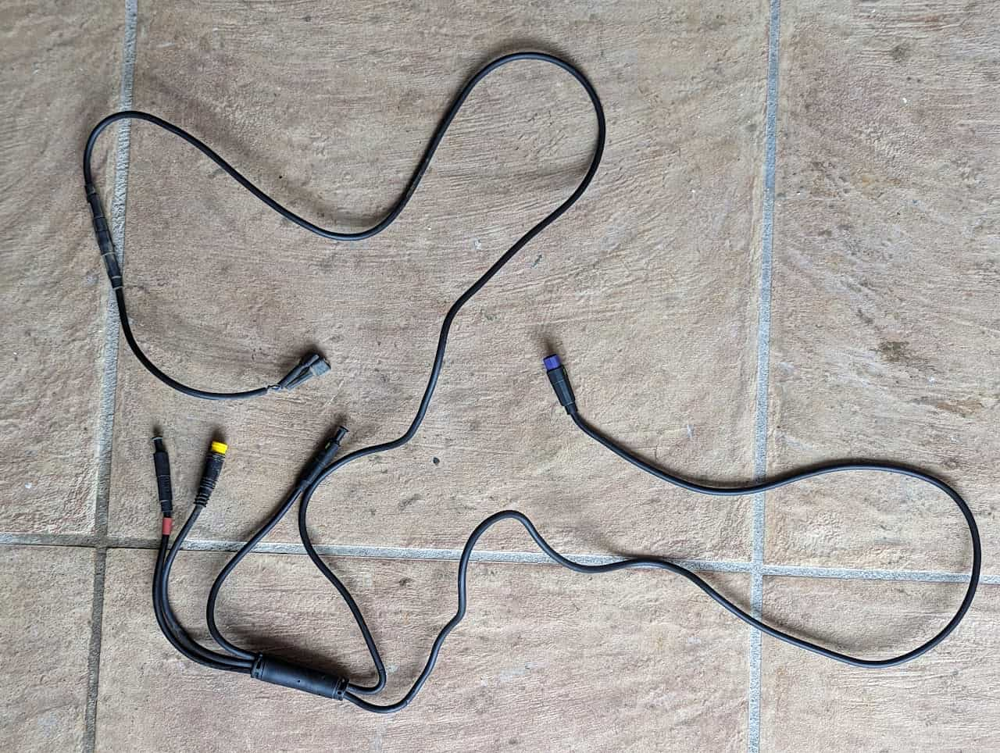

The 12V harness

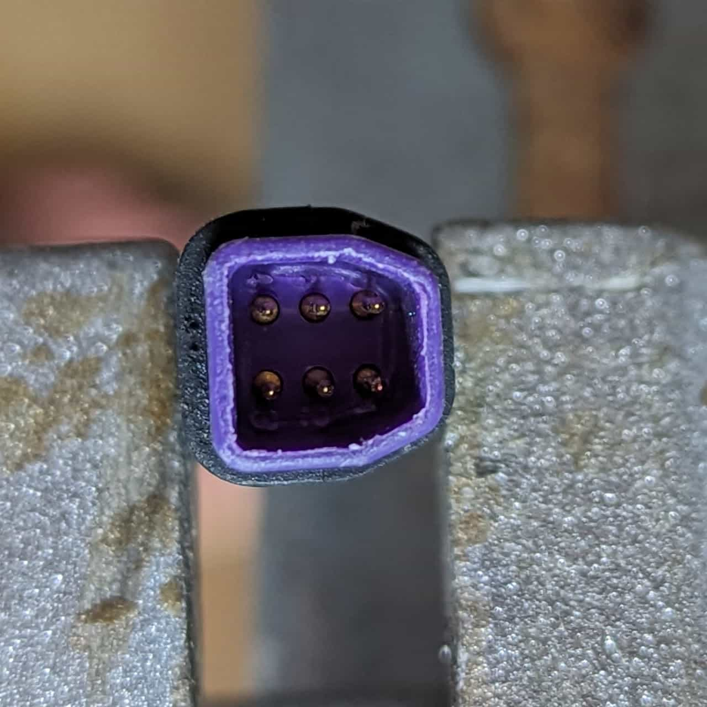

[12V Module](/components/electrical/12v-module) connector

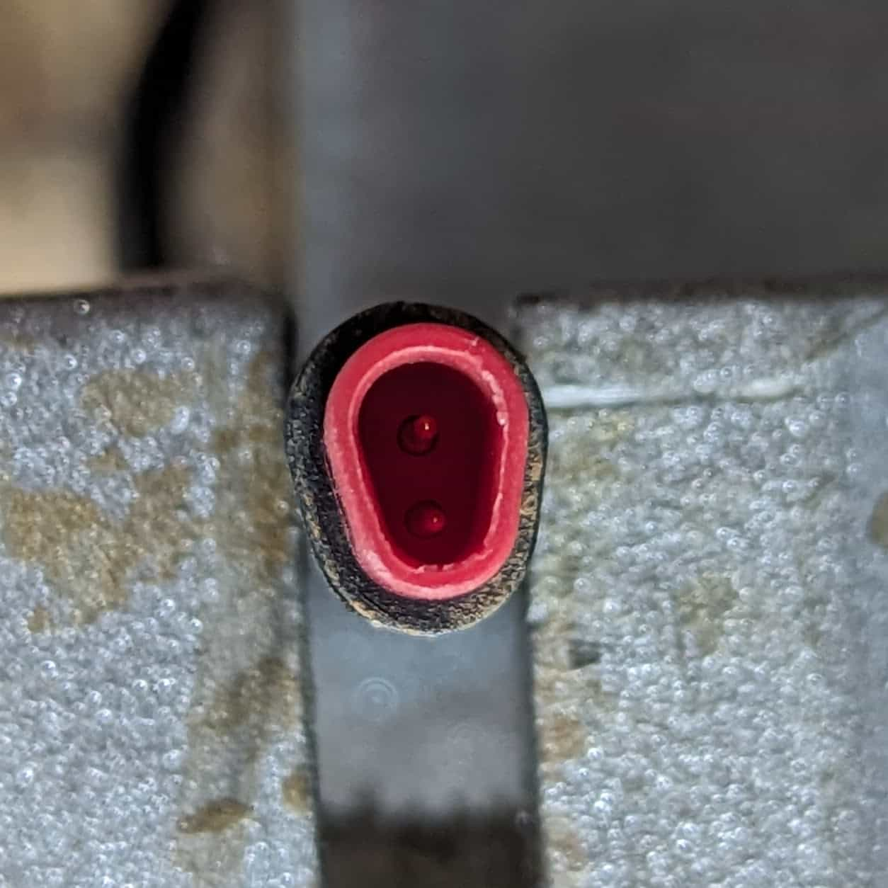

Horn connector

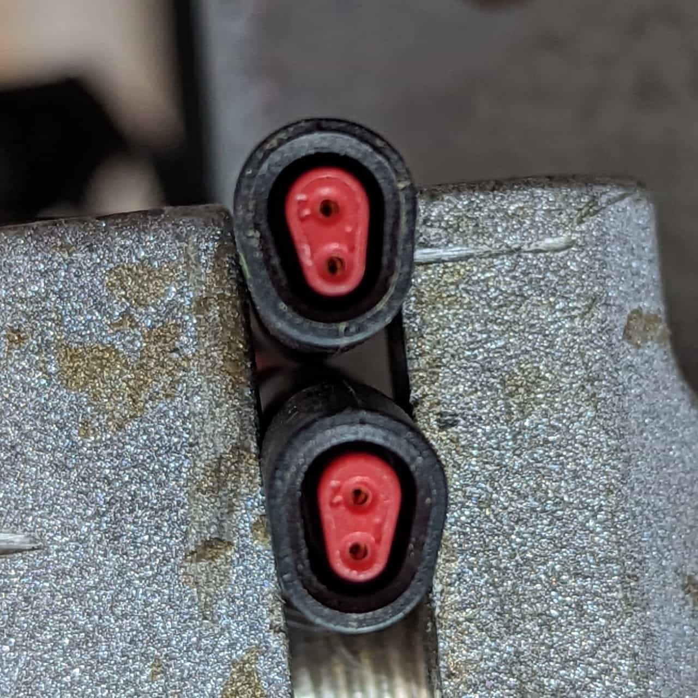

Front turn signal connectors? (Unused)

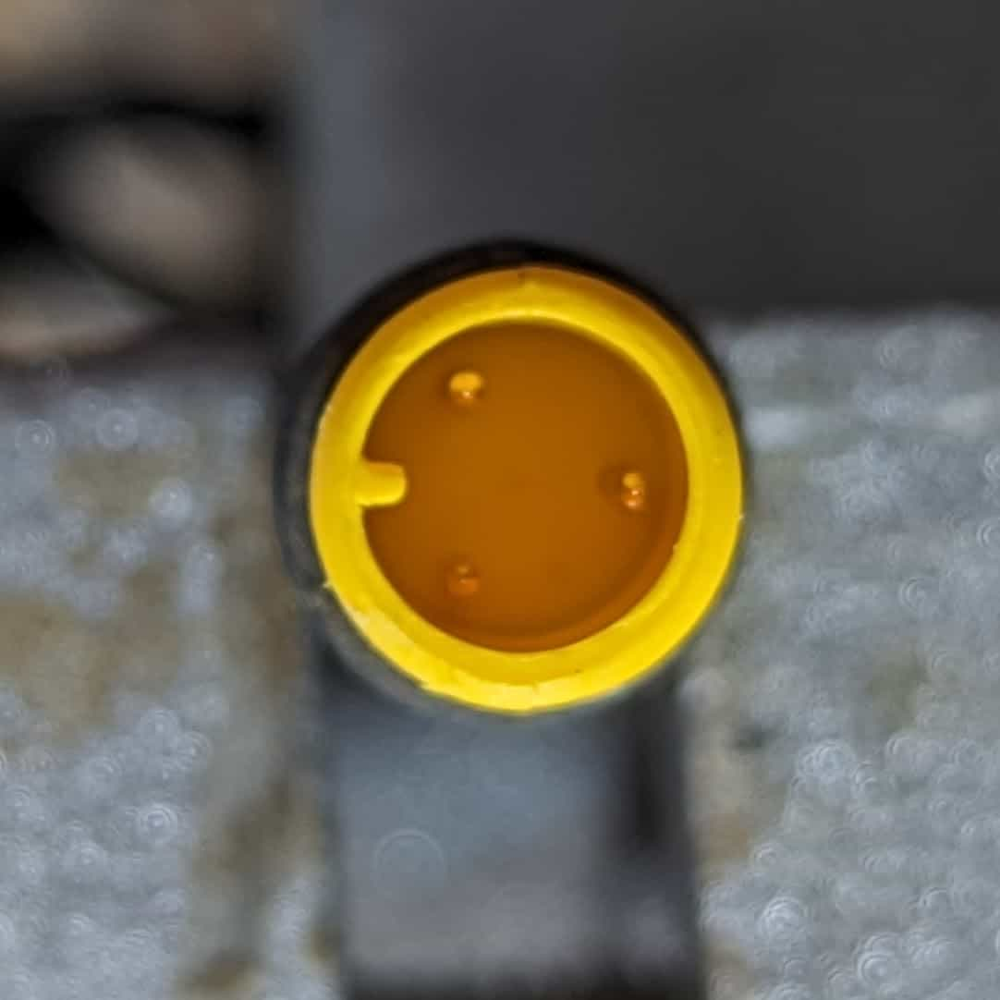

Headlight connector

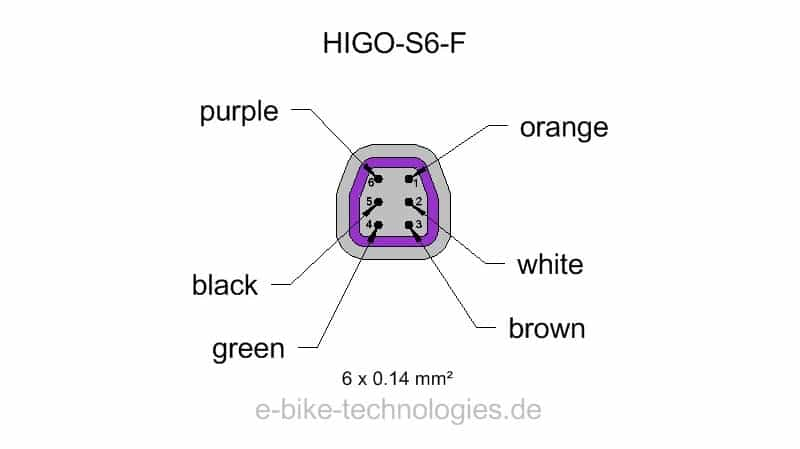

### [12V Module](/components/electrical/12v-module) connector

1. Turn signal - Turn signal (left) 1
2. Signal1- Headlight 2
3. Horn - Horn 2
4. 12V - Headlight 3
5. GND - Horn 1 / Headlight 1 / Turn signals 2
6. Turn signal  - Turn signal (right) 1

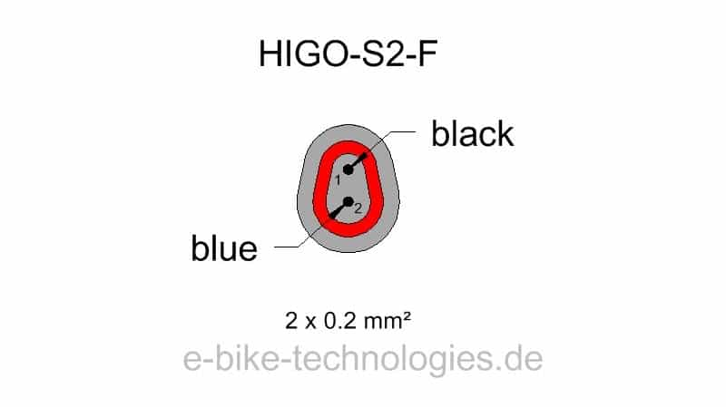

### Horn connector

1. GND
2. Horn

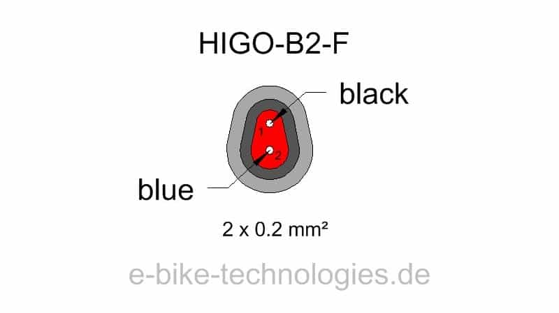

### Front turn signal connectors? (Unused)

1. GND
2. Turn signal

### Headlight connector

1. GND
2. Signal1
3. 12V

## Additional Images

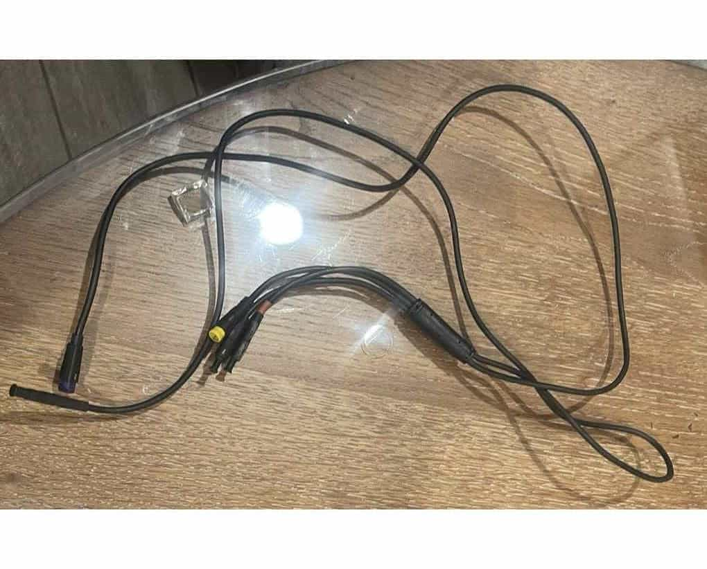

Secondary Lighting Harness; image found on eBay; note the cap for the horn end.

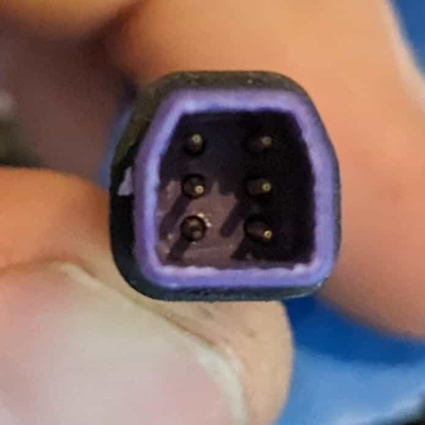

Input for Secondary Lighting Harness.

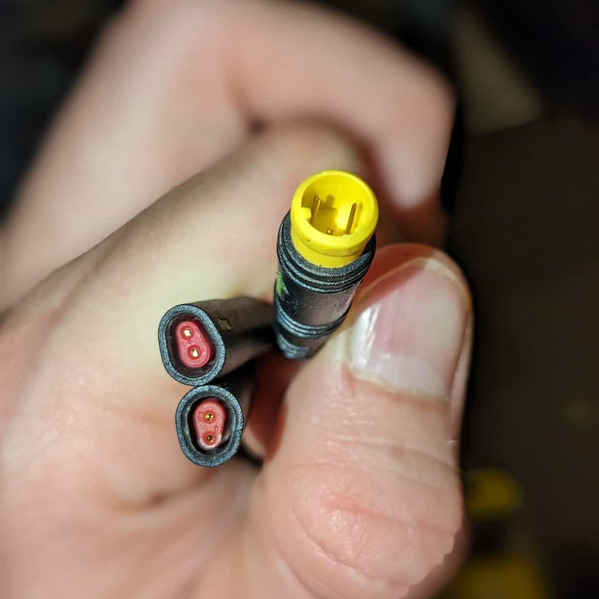

Lighting connectors for headlight and turn signals (capped on the RX).

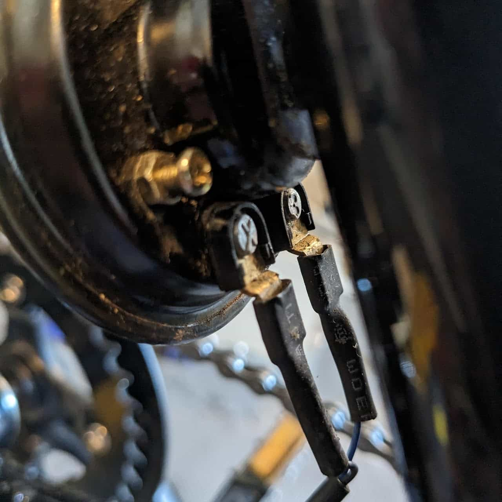

Horn output.
