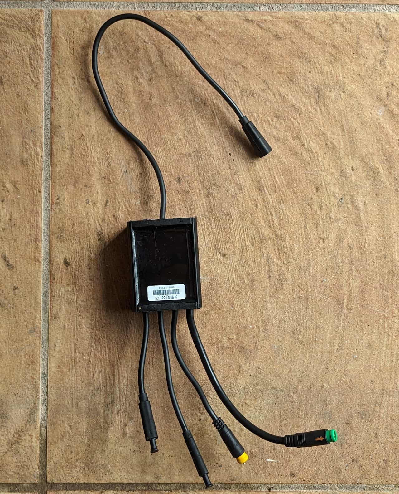
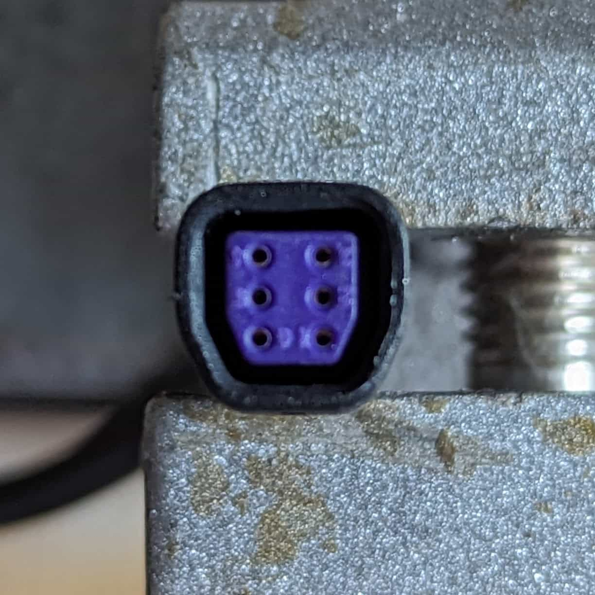
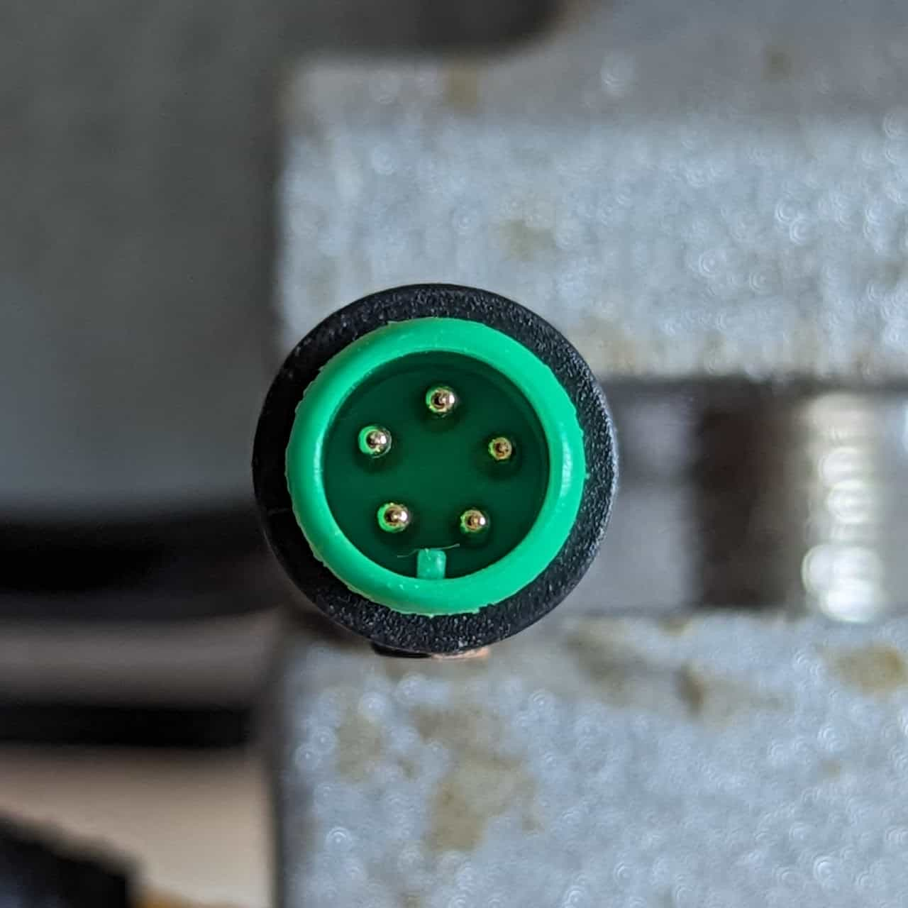
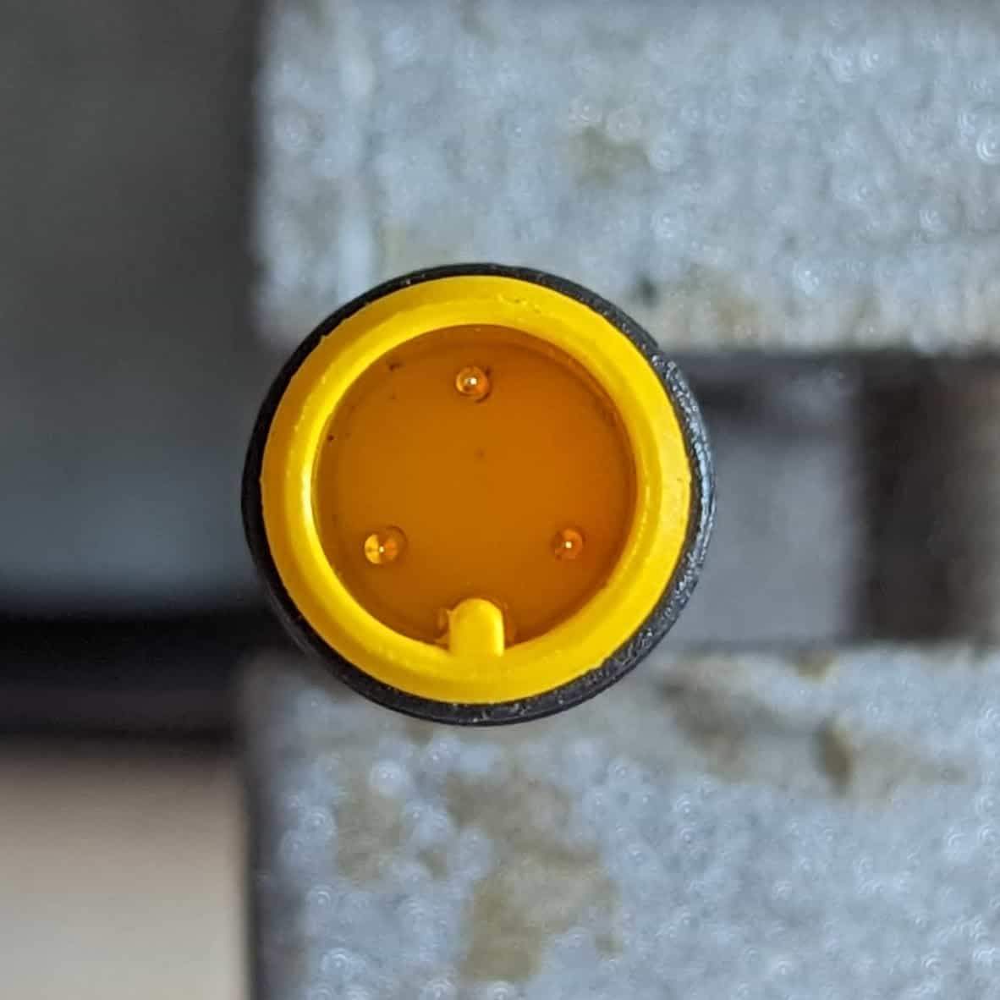
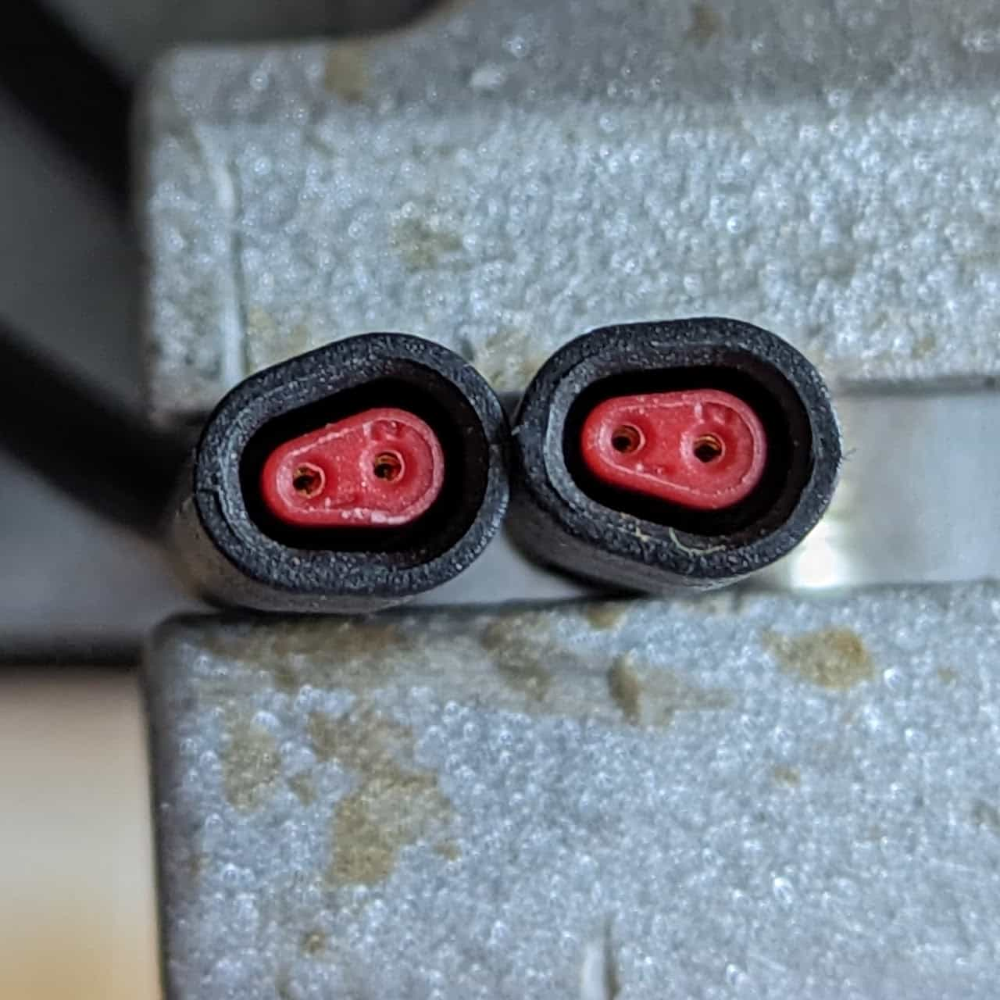
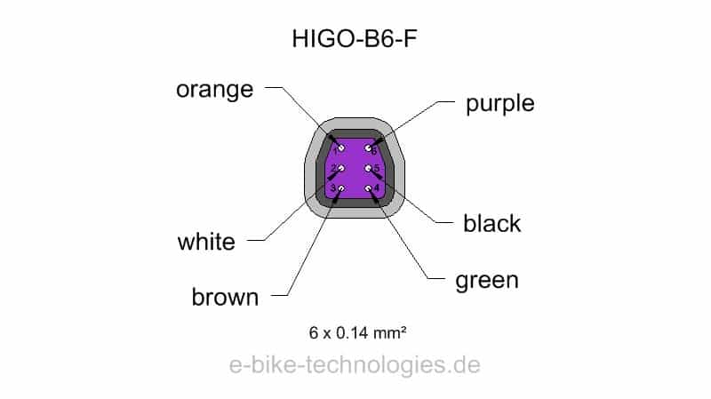
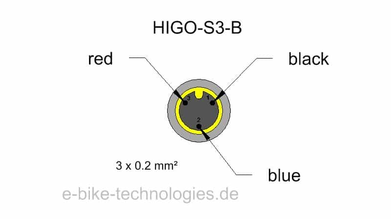

This module is attached to the main controller and converts the controller's 48V to 12V.  It manages all 12V  peripherals and is controlled through a CAN bus. 

* Marked: "SUPER73\_DC\_DC\_V20" "210118231"

The module will not output 12V at all unless its CAN bus is connected to the controller, even if provided with 48V. Hence, it can't be used in an aftermarket setup.

The 12V module

[12V Harness](/components/electrical/12v-harness) connector

[Controller](/components/electrical/controller) connector

Rear brake light connector

Turn signal connectors (unused)

### [Controller](/components/electrical/controller) connector

1. Unknown
2. CAN L
3. GND
4. Battery +  (common with controller, debug 1)
5. CAN H

### [12V Harness](/components/electrical/12v-harness) connector

1. Turn signal
2. Signal 2
3. Horn
4. Unknown
5. GND
6. Signal 1

### Rear brake light connector

1. Ground
2. Signal
3. 12V

### Turn signal connectors (unused)

1. GND
2. 12V
