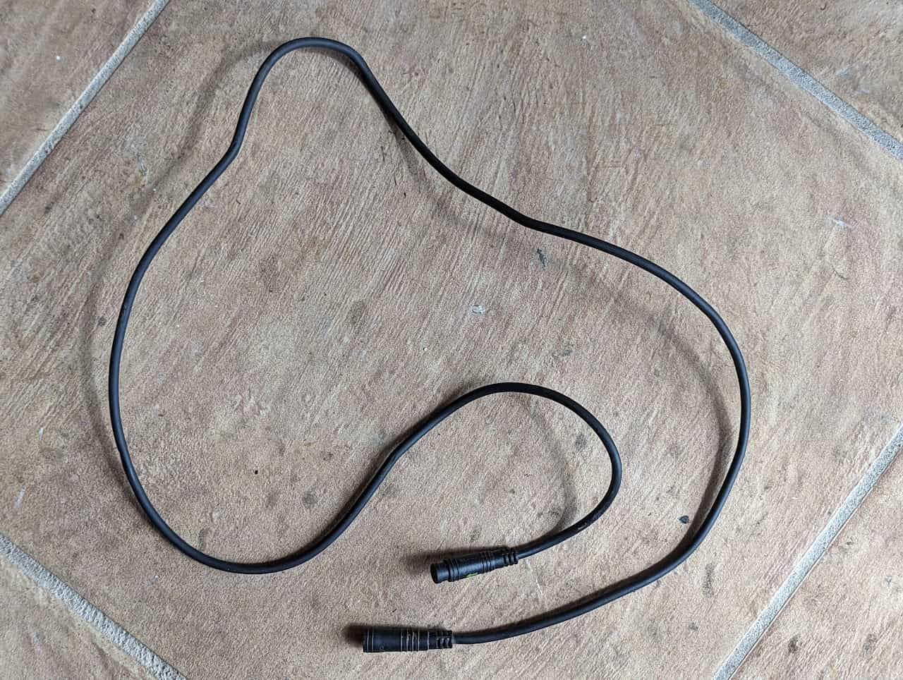
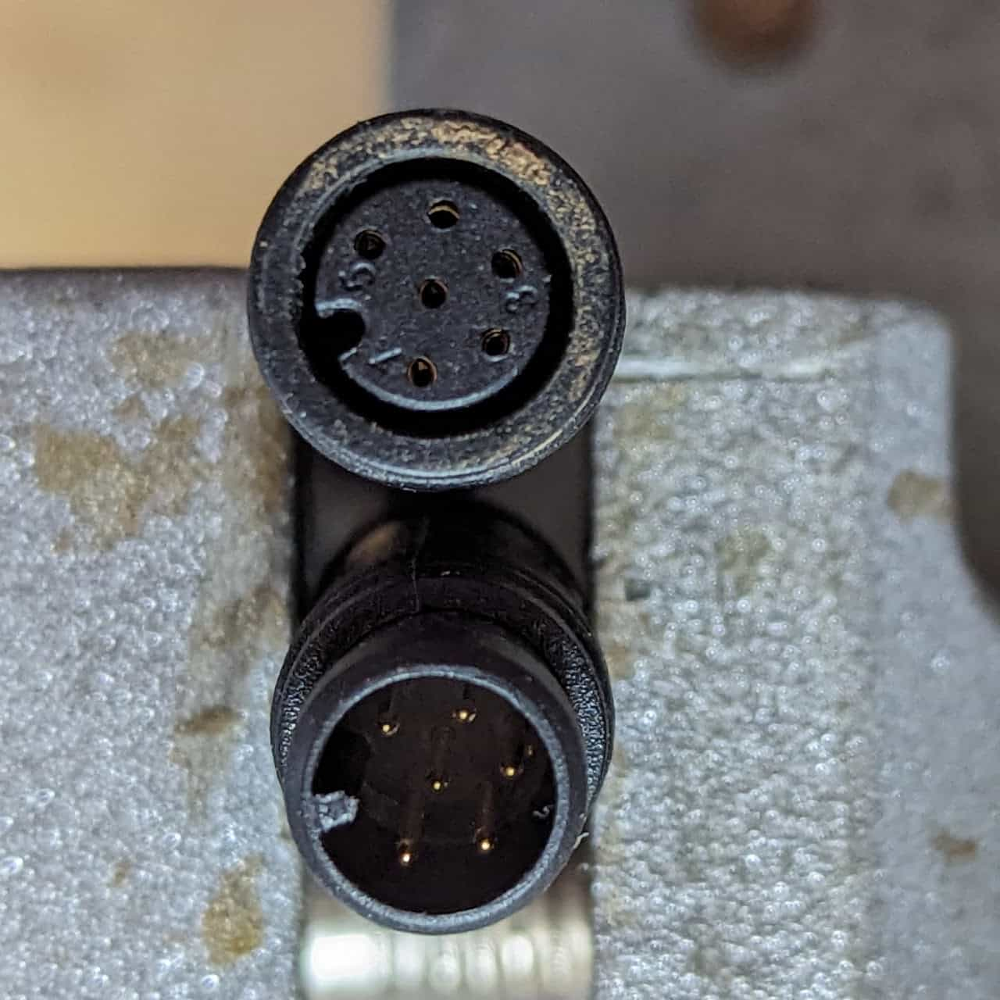
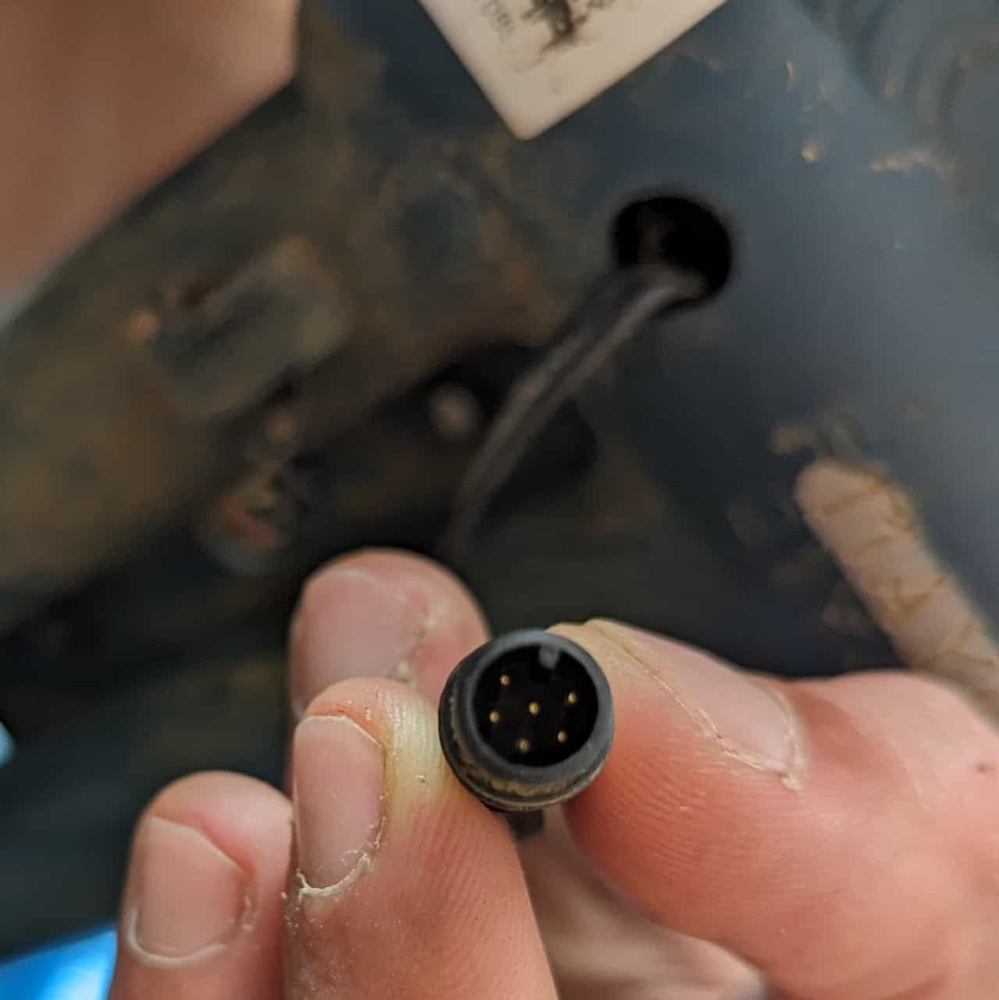
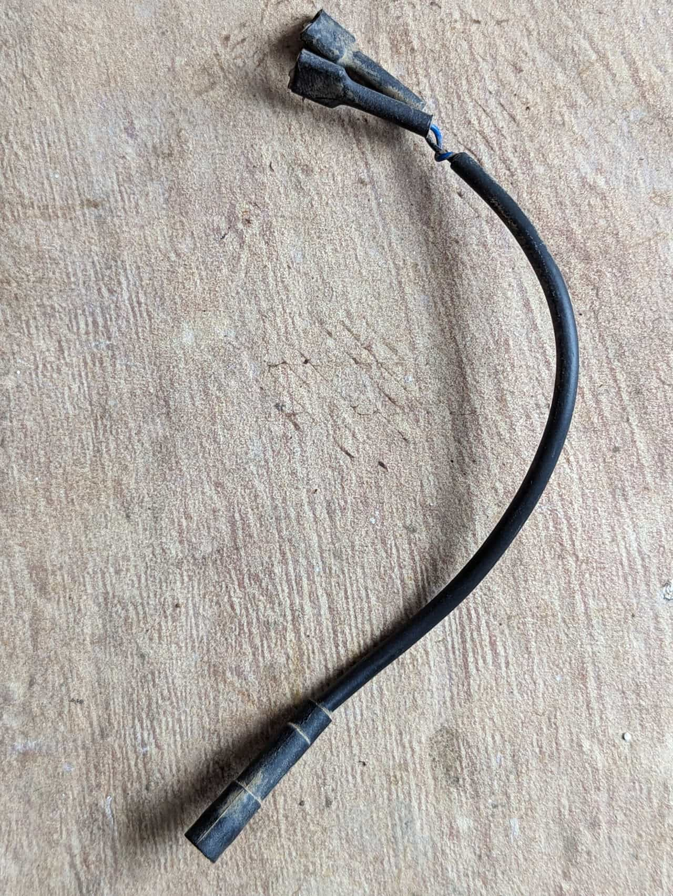
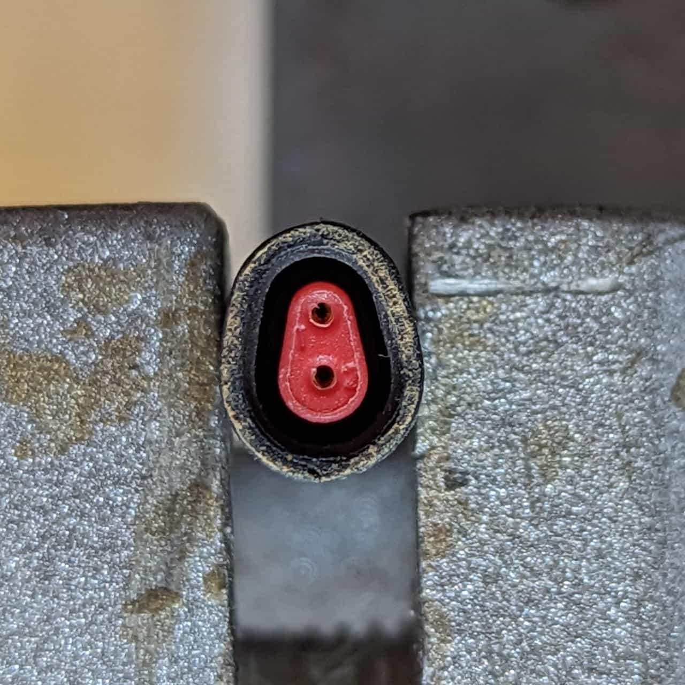
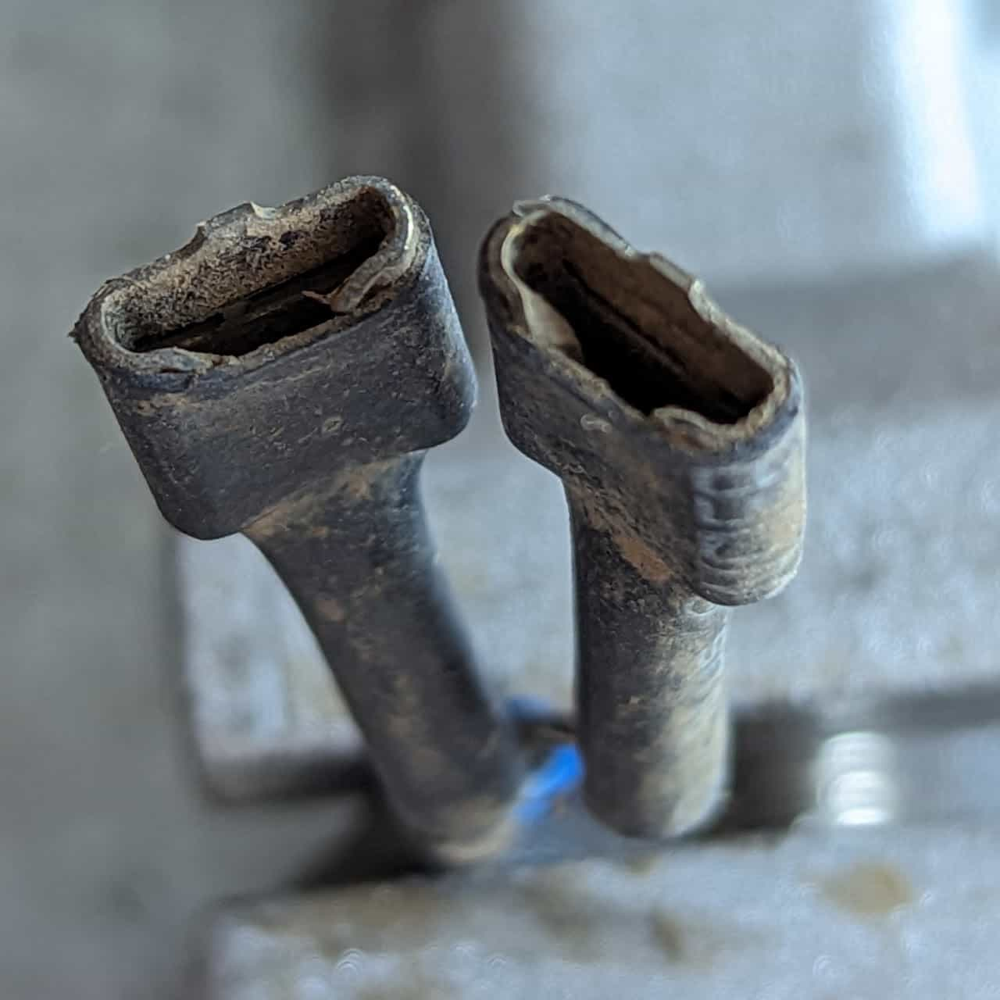

# Additional Cables/Adaptors

## Additional Cables/Adaptors

Various cables and adaptors present in the stock wiring.

## PAS Sensor extension cable

The PAS Sensor extension cable

Extension cable connectors

PAS Sensor between pedals

A simple 6 pin Higo extension cable connecting the [controller's](/components/electrical/controller) PAS sensor connector to the actual sensor between the pedals.

## Horn adaptor

The horn adaptor

Female Higo 2 pin

Female spade terminals

A short adaptor connecting the horn's spade terminals to the [12V Harness'](/components/electrical/12v-harness) horn Higo connector.
