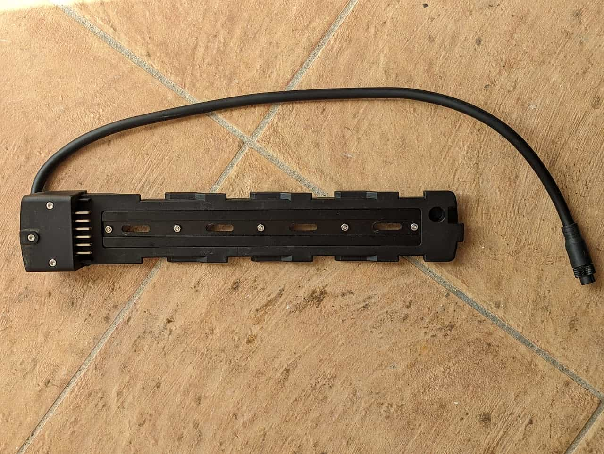
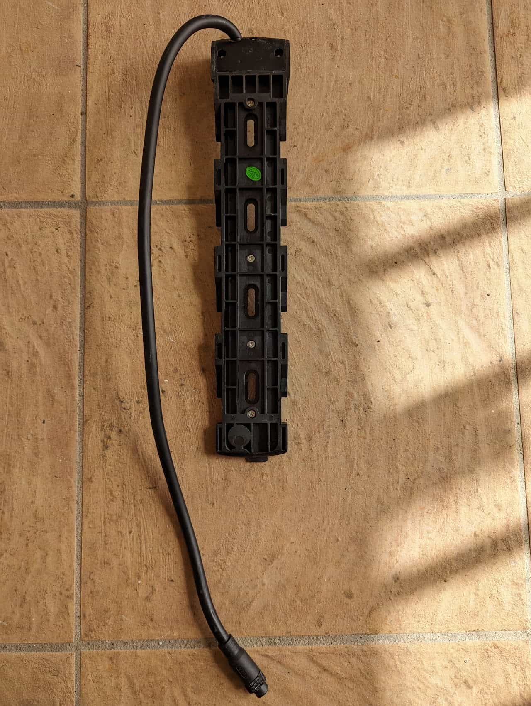
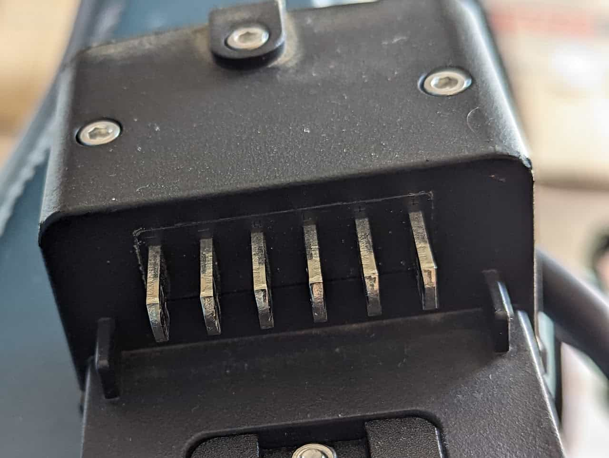
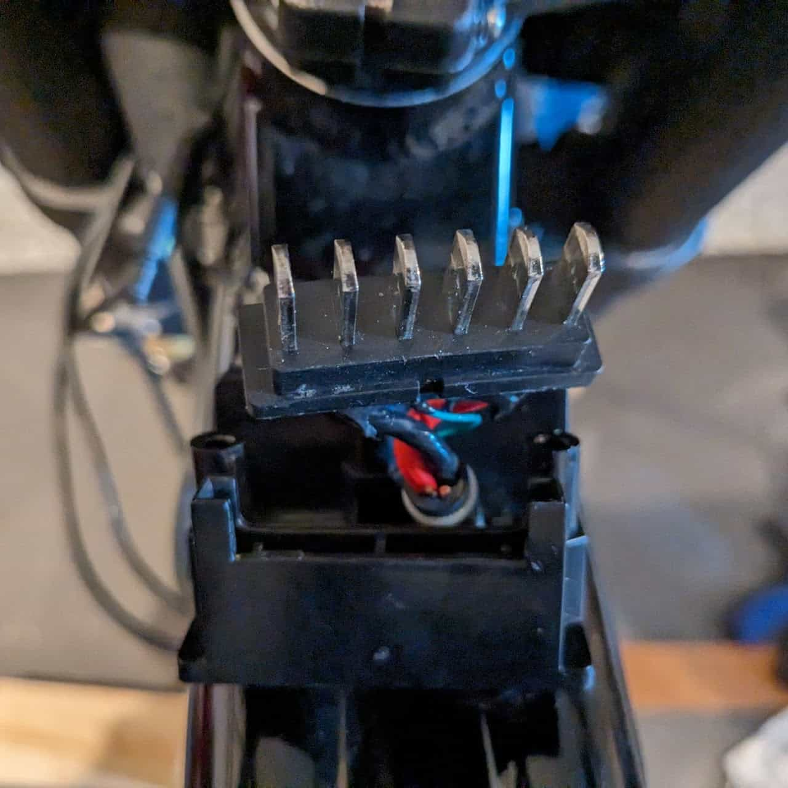
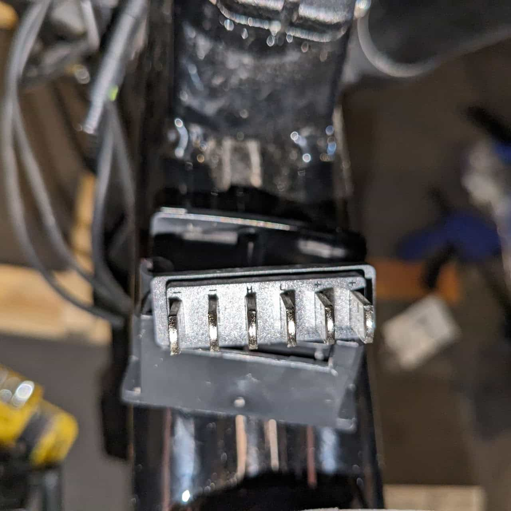
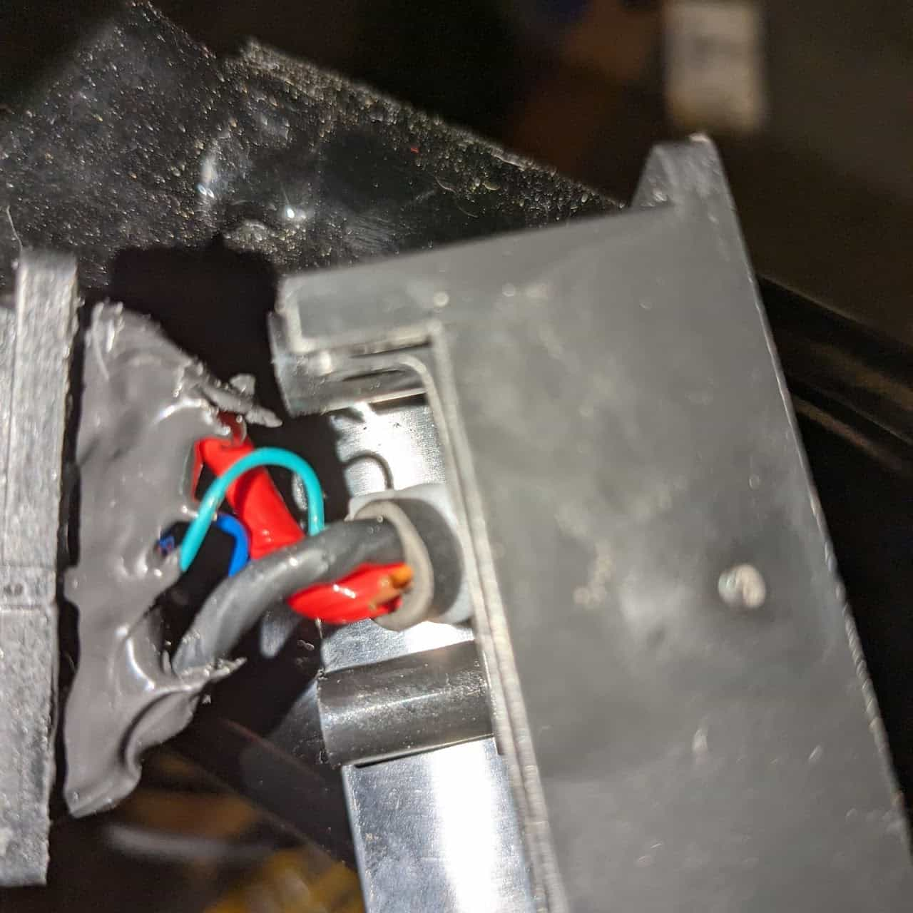
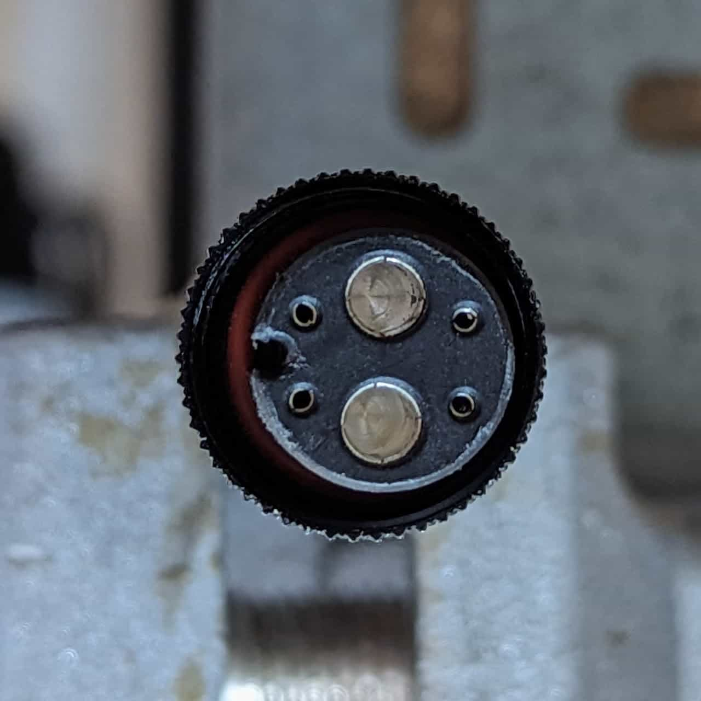
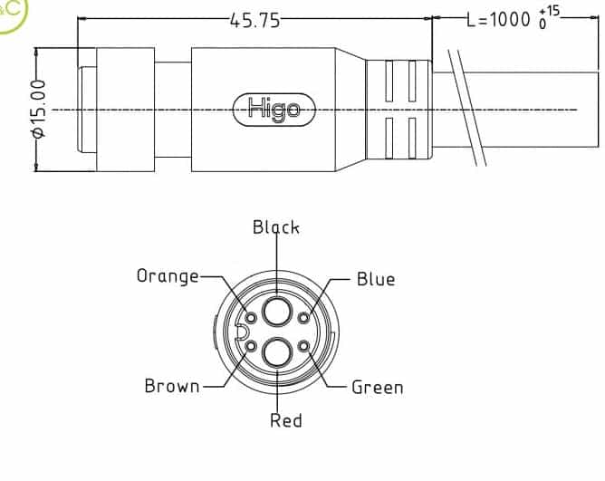

[Teardown](/components/electrical/battery-cradle/cradle-teardown)

The Battery Cradle secures the battery to the bike and connects it to the [controller](/components/electrical/controller).

* Interface

  + 6 male pins labeled - - H L + +

    1. thick black - negative
    2. thick black - negative
    3. green - CAN bus CANH
    4. blue - CAN bus CANL
    5. thick red - positive
    6. thick red - positive
  + Cable - L615AM Female

    1. <https://www.higoconnector.com/products/l615am-p-00-dc-1000/hw99K#title>
* Screws

  + 4 x ?? (3mm hex) - frame
  + 3 x ?? (2.5mm hex) - cradle

Battery Cradle Top

Battery Cradle Bottom

Battery Cradle Blades

Battery Cradle Blades detail, partial disassembly

Battery Cradle Blades detail, partial disassembly

Battery Cradle Blades detail, partial disassembly

Battery Cradle Blades detail, partial disassembly

[Controller](/components/electrical/controller) connector

### [Controller](/components/electrical/controller) connector

1. Orange - Unused
2. Brown - Unused
3. Black - Negative
4. Red - Positive
5. Blue - CAN L
6. Green - CAN H
