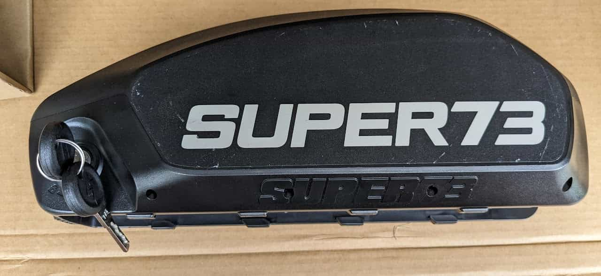
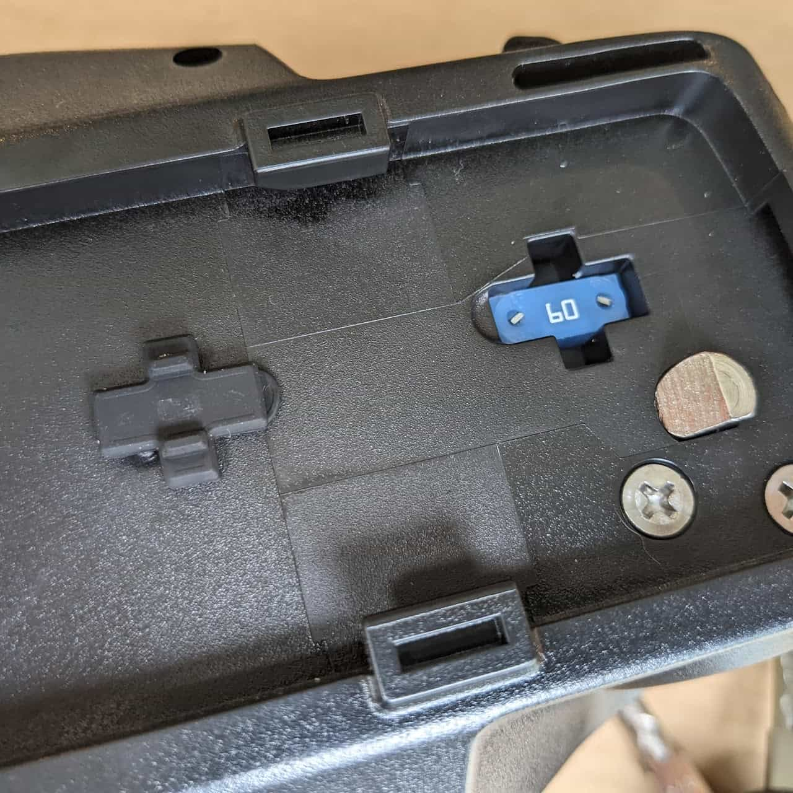
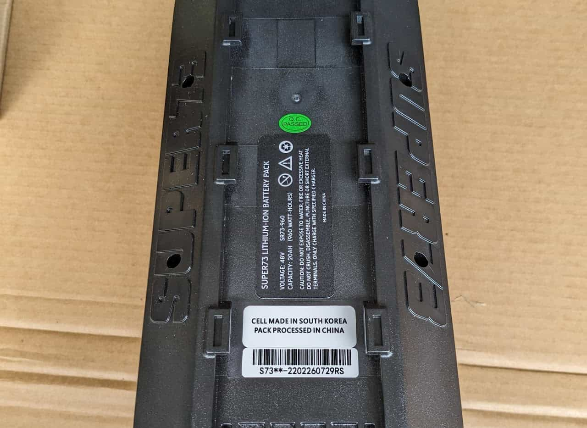
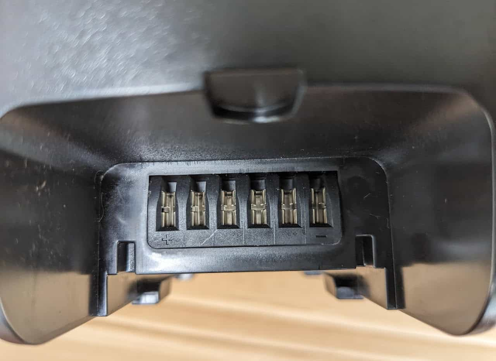
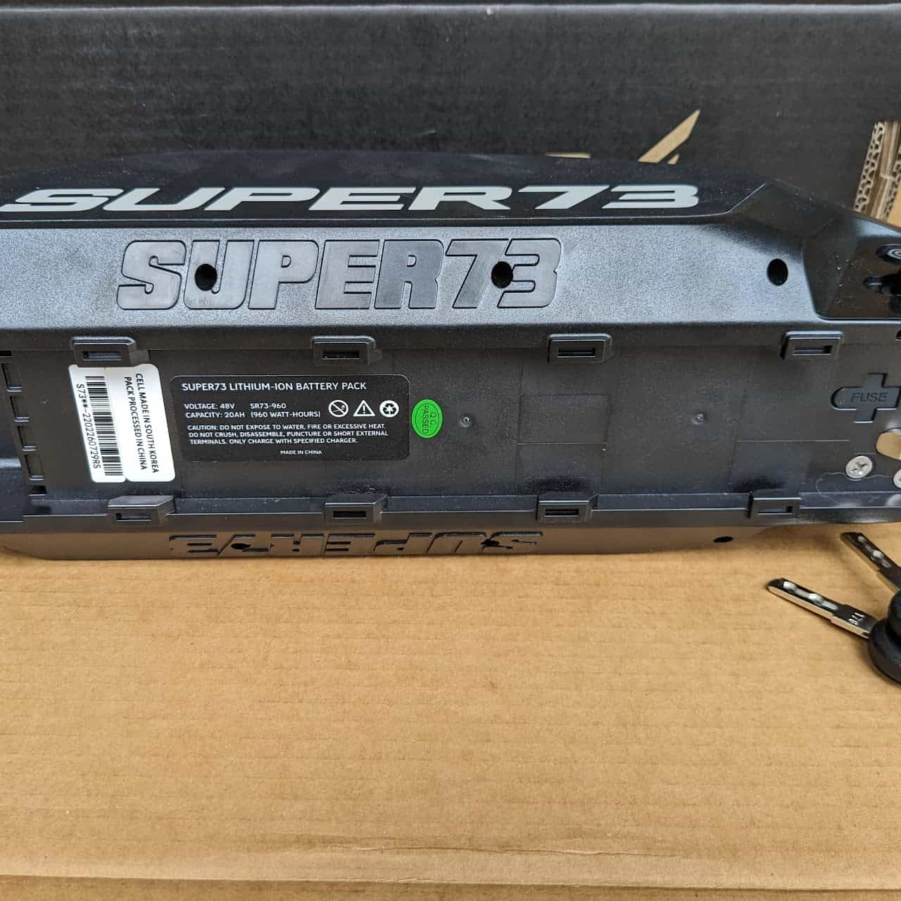
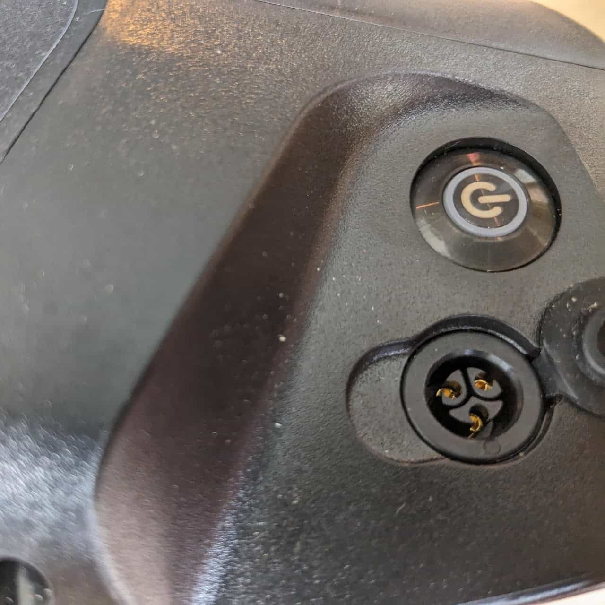

# Battery

[S & R Series "Newport"](#s-r-series-newport)

[Z Series](#z-series)

[K1D](#k1d)

## S & R Series "Newport"

[Teardown](/components/electrical/battery/newport-teardown)

* Model: SR73-960
* 3-Pin Charger Compatibility: 2 amp, 3 amp, 5 amp  (see below for charging port replacement part)
* Voltage: 48V
* Capacity: 20AH
* Watt Hours: 960WH
* Weight: 11.2lbs
* Dimensions

  + Length: 14in
  + Width: 5.5in
  + Height: 4.25in
* Interface

  + 3 pin charging port

replacement battery-side charging port: backfireboardsusa.com, select "charging port - hammer sledge"

* + 6 female pins labeled + □ □ □ □ -

    1. Positive
    2. Positive
    3. CAN bus CANH - not labeled
    4. CAN bus CANL - not labeled
    5. Negative
    6. Negative

Label is misleading; center 2 pins are CAN

* Notes

  + 60 amp automotive fuse covered with a rubber cover
  + Battery button back-lights white when turned on
  + Comes with 2 keys

Battery side and lock

60 amp automotive fuse.

Battery lower perspective

Battery pins

Side and lower perspective

Battery charging port and power button

## Z Series

* Voltage: 48V
* Capacity: 12.8Ah
* Watt Hours: 615WH

## K1D

* Voltage: 48V
* Capacity: 2.9Ah
* Watt Hours: 92.8WH
