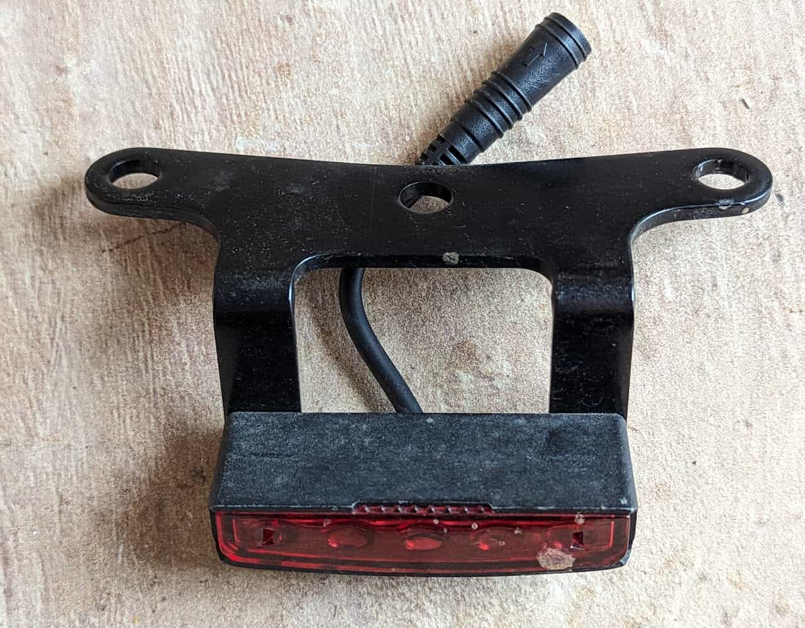
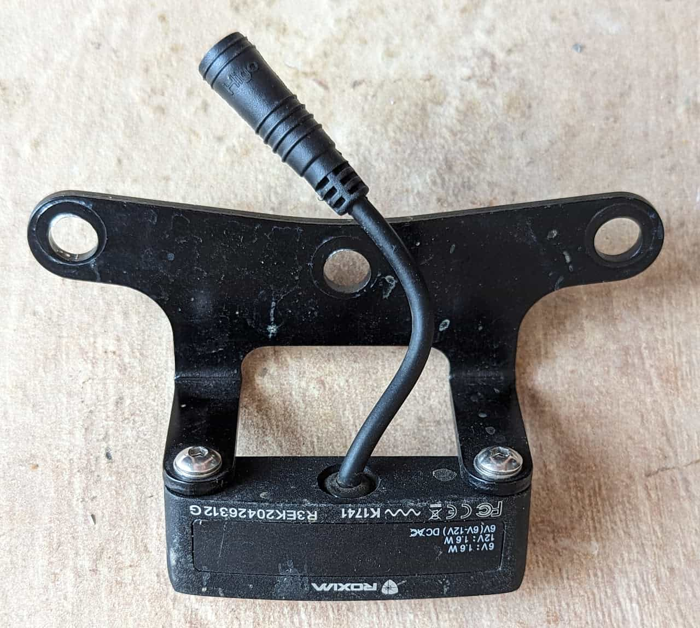
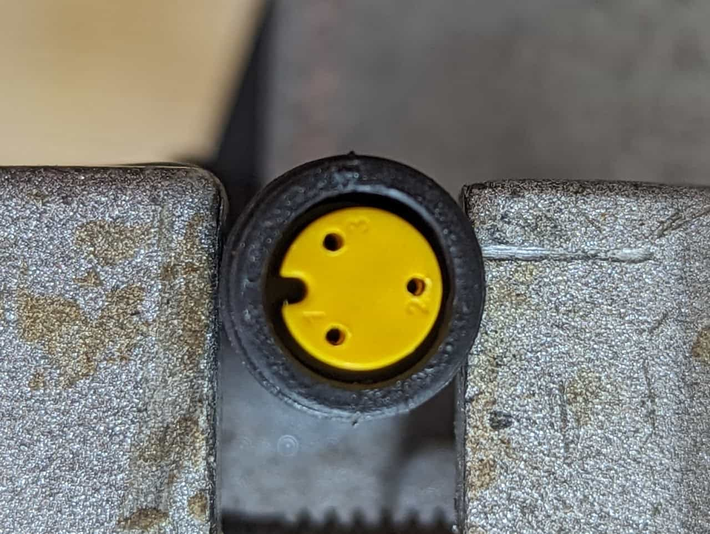
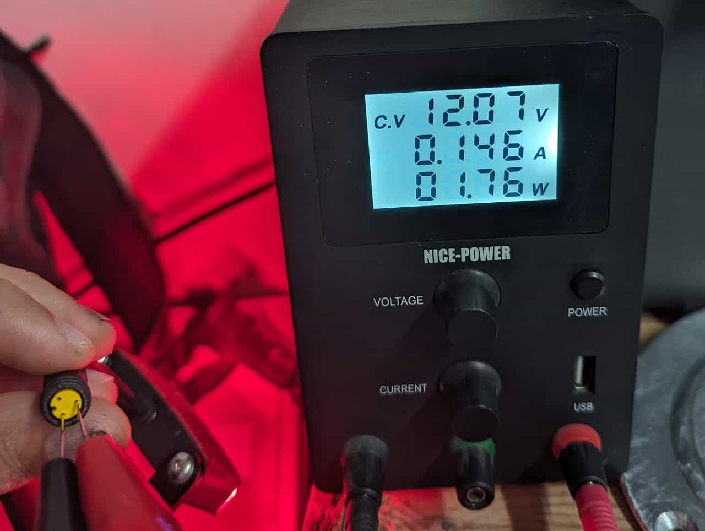
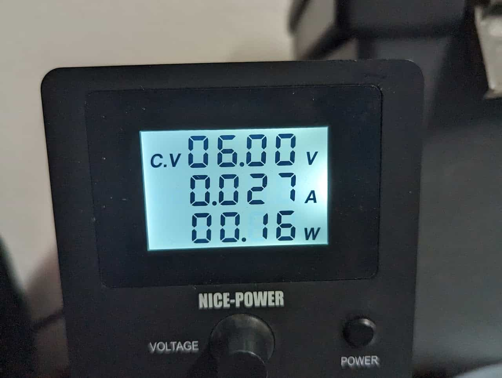
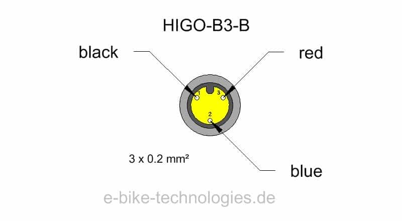

# Brake Lights

[S2 brake lights](#s2-brake-lights)

[RX break light](#rx-break-light)

## S2 brake lights

Modes:

* LOW: lower brightness (constantly on by default), works on 6-12V provided to pin 2
* HIGH: high brightness (breaking indicator), works on 12V provided to pin 3, overrides LOW

Specs:

* 6 - 12V
* ~0.16W @ 6V-LOW , ~1.72W @ 12V-HIGH
* LED

The brake light front

The brake light back

[12V Module](/components/electrical/12v-module) connector

Power draw 12V high mode

Power draw 6V low mode

### [12V Module](/components/electrical/12v-module) connector

1. GND
2. 12V HIGH
3. 6-12V LOW

## RX break light
