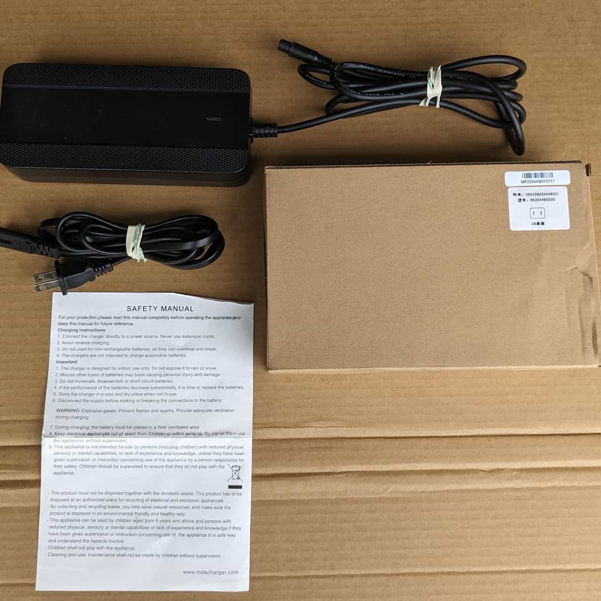
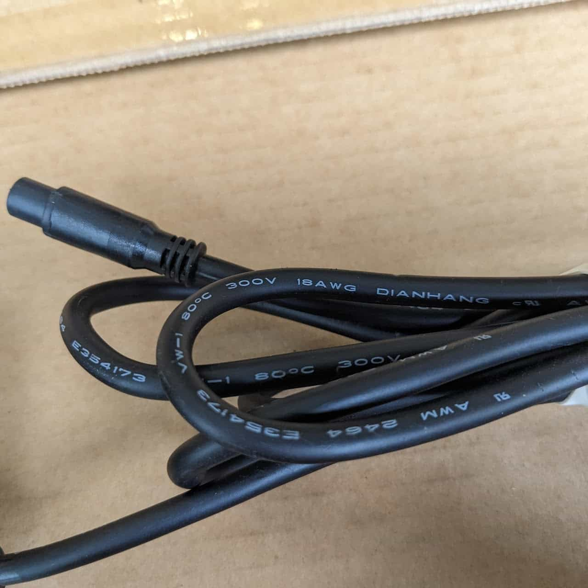
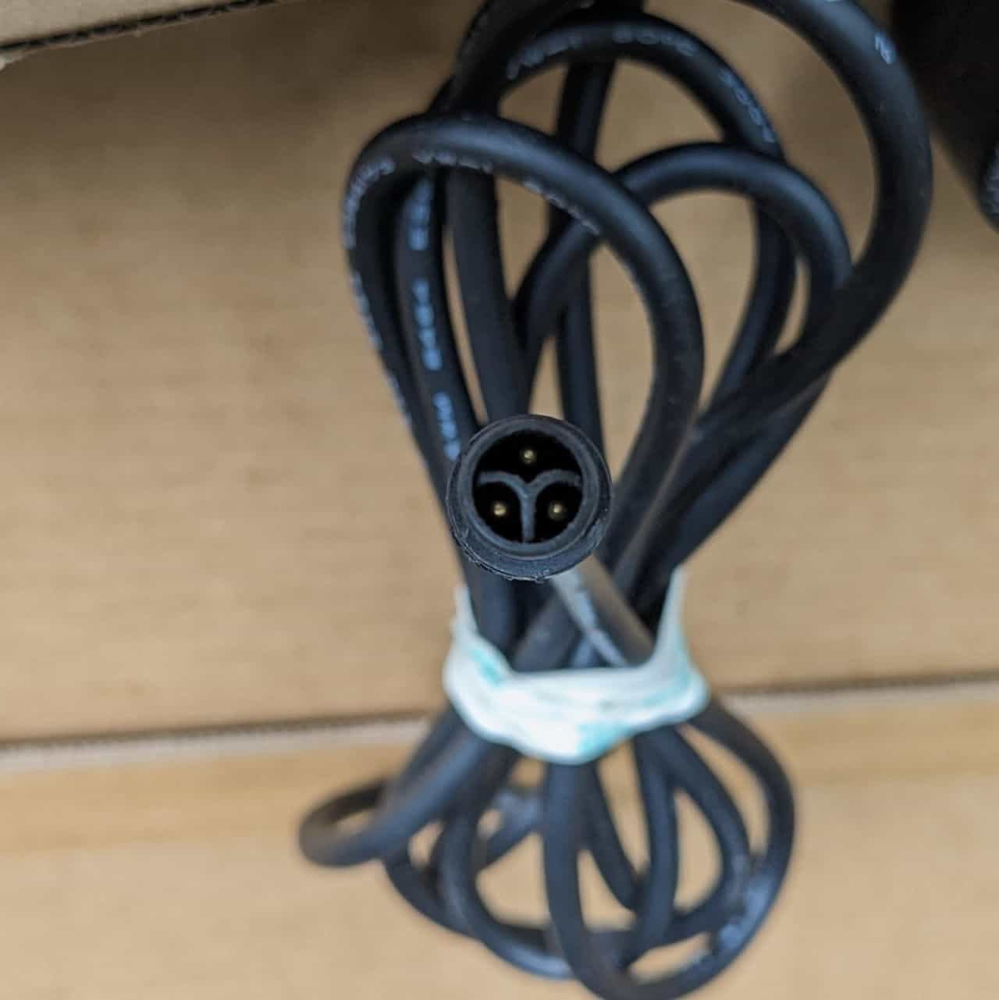
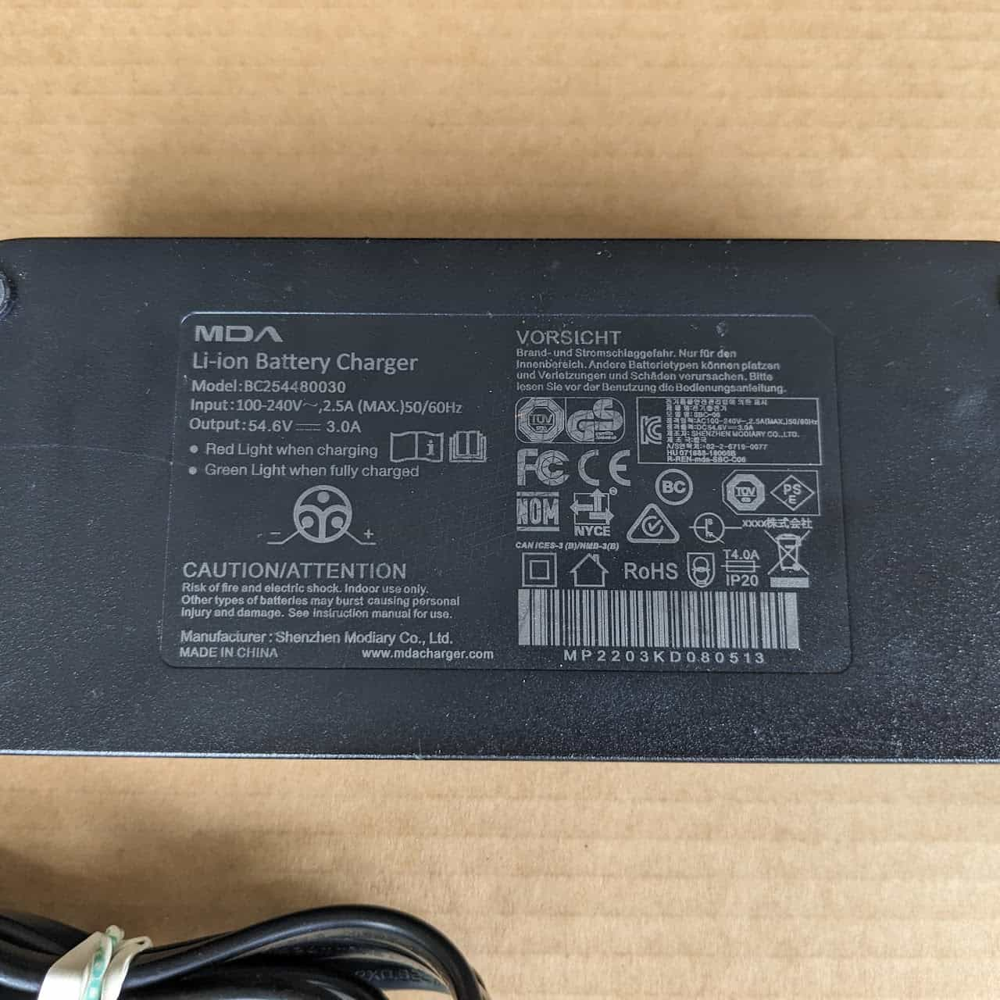

# Charger

[Charger Teardown](/components/electrical/charger/charger-teardown)

## MDA Li-ion Battery Charger

This is the battery that ships with the original bike.

* Manufacturer: <https://www.mdacharger.com/>
* Model: BC254480030
* Input: 100-240V ⏦,2.5A (max) 50/60Hz (Alternating Current)
* Output: 54.6V ⎓ 3.0A (Direct Current)
* Back of the Unit Notes:

  + Red Light when charging
  + Green Light when fully charged
* Cable - 18 AWG
* Connector - 3 pin with a proprietary connector

  + Center pin looks unused
  + Lower Left pin is Negative
  + Lower Right pin is Positive

### Modification

A guide for modifying the charger, and optionally the battery itself, to work with [Grin Technologies Cycle Satiator](https://ebikes.ca/product-info/grin-products/cycle-satiator.html): <https://www.reddit.com/r/Super73/comments/invi7q/upgrading_to_a_better_charger_a_guide/>

There's a relevant quote in the guide regarding the center pin:

We only want the red and black to be terminated properly as the Yellow Signal wire is not really used for anything inside the battery pack itself.

An original charger box with cables and safety manual.

Detail of the cable, including the American Wire Gauge size (18 AWG).

Detail of the connector that mates with the battery.

Back of the charger, including the connector diagram.
