This is the main controller linking the battery, motor, controls, and peripherals. 

* Marked: "SUPER73\_S2\_EU\_V203" "210120391"

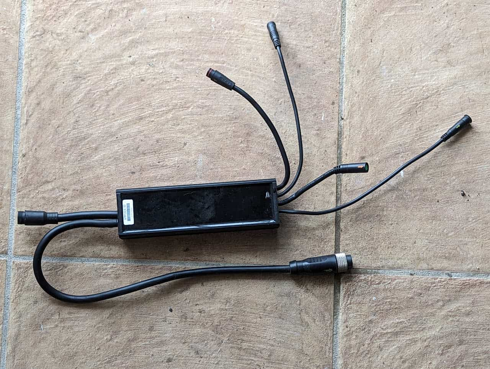

The controller

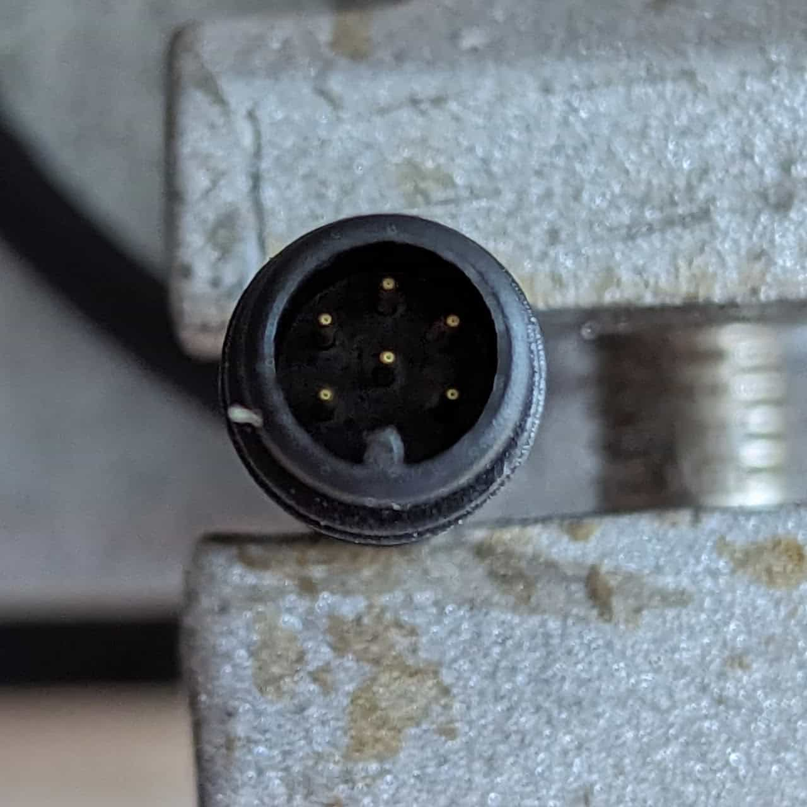

Debug connector (unused)

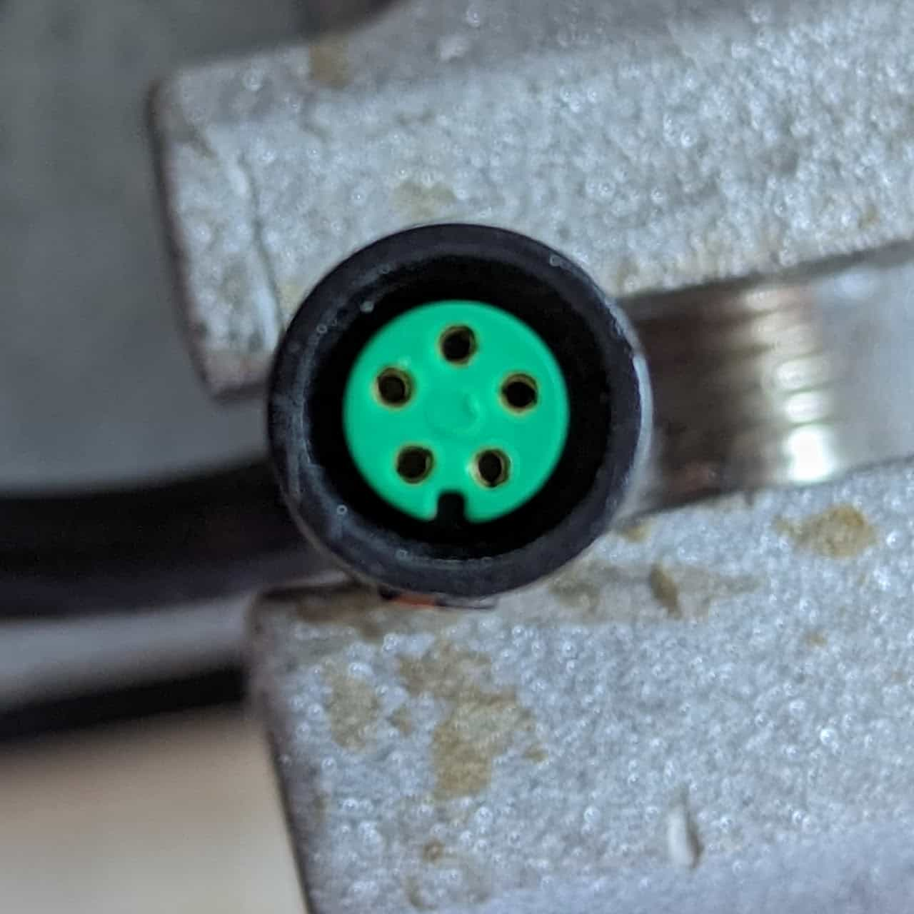

[12V Module](/components/electrical/12v-module) connector

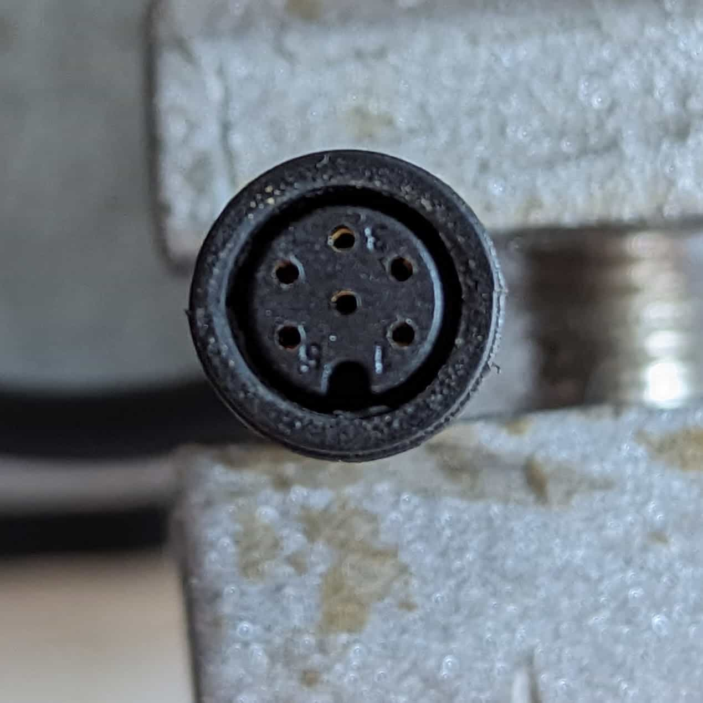

PAS sensor connector

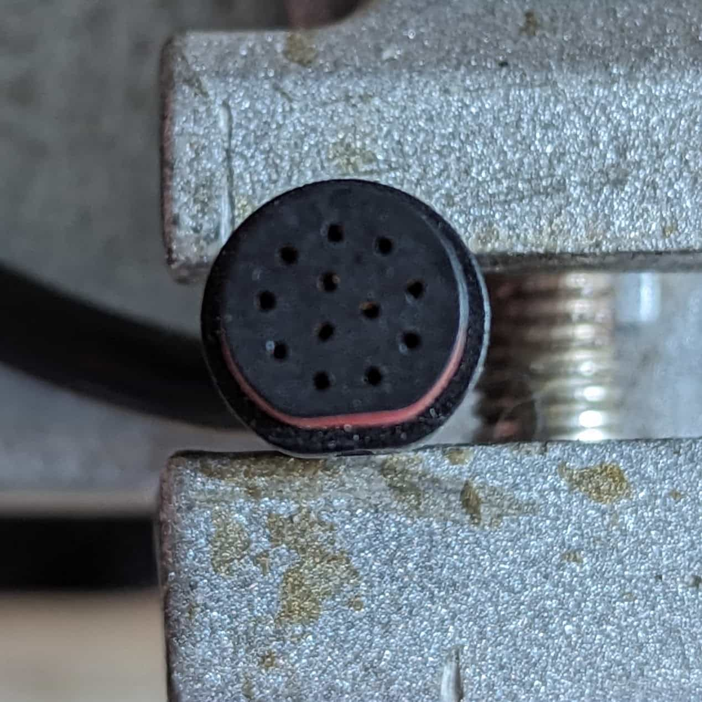

[Primary harness](/components/electrical/primary-harness) connector

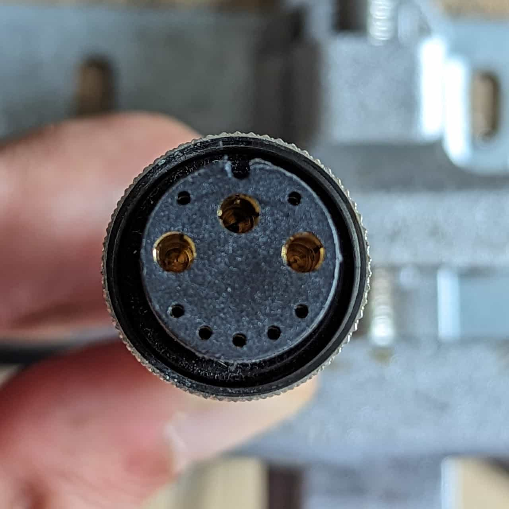

[Motor](/components/electrical/motor) connector

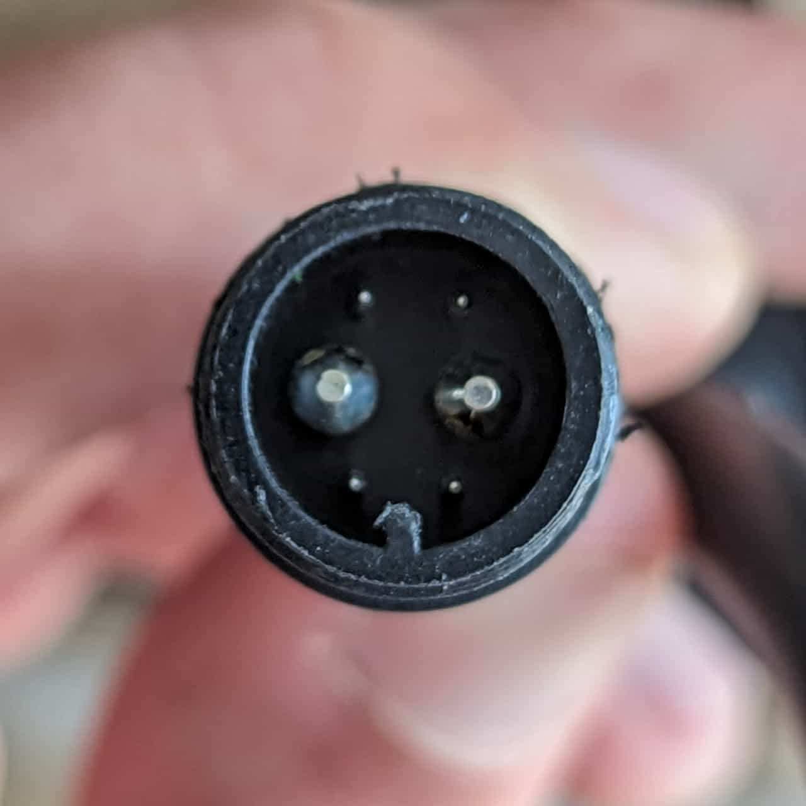

Battery connector

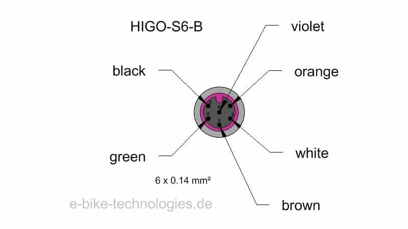

### Debug connector

1. Battery +  (common with [12V Module](/components/electrical/12v-module) 4)
2. Unknown
3. GND
4. CAN H
5. CAN L
6. Unknown

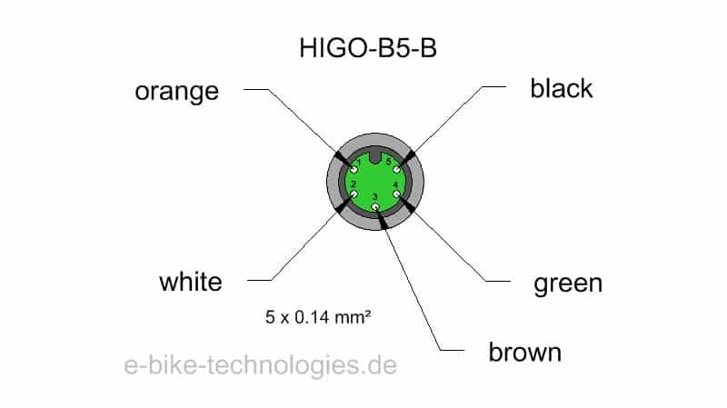

### [12V Module](/components/electrical/12v-module) connector

1. Unknown - Blue
2. CAN L - Yellow
3. GND - Black
4. Battery +  (common with debug 5) -  White
5. CAN H - Green

### PAS sensor connector

1. Unknown (~5V)
2. Unknown (~5V)
3. Unknown
4. Unknown (~6V)
5. GND
6. Unkown (GND?)

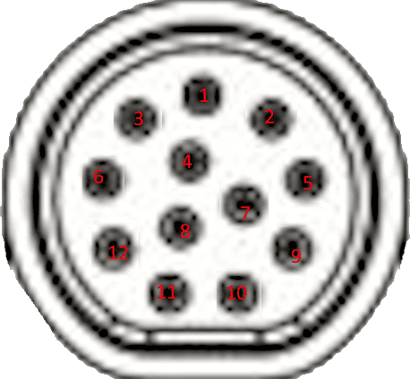

### [Primary harness](/components/electrical/primary-harness) connector

1. CAN H - Display 4 - Yellow
2. Throttle signal - Throttle 2 - Blue
3. Signal 1 - Horn 1 - Orange
4. Signal 6 - Display 1 - Purple
5. Signal 2 - Horn 2 - Green
6. CAN L - Display 5 - Grey
7. 5V - Throttle 3 - Pink
8. GND - Throttle 1 / Horn 5 / Display 3 / Brake 1 - Black
9. Signal 7 - Brake 2 - Red
10. Signal 3 - Horn 3 - White
11. Signal 5 - Display 2- Black w/ white stripe
12. Signal 4 - Horn 4 - Brown

### [Motor](/components/electrical/motor) connector

See image.

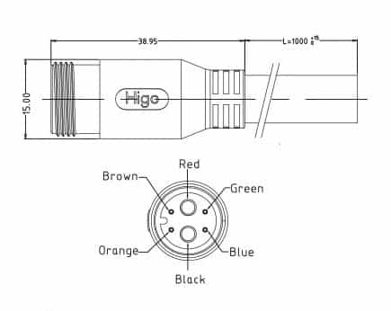

### Battery connector

1. Brown - Unused
2. Orange - Unused
3. Red - Positive
4. Black - Negative
5. Green - CAN H
6. Blue - CAN L
