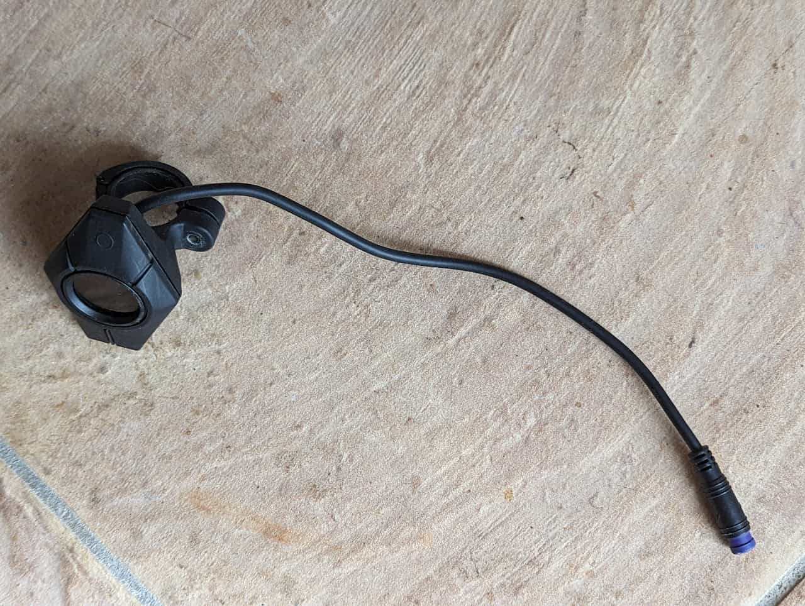
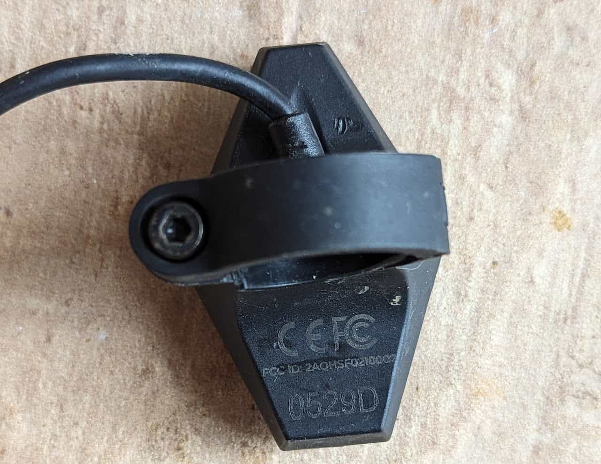
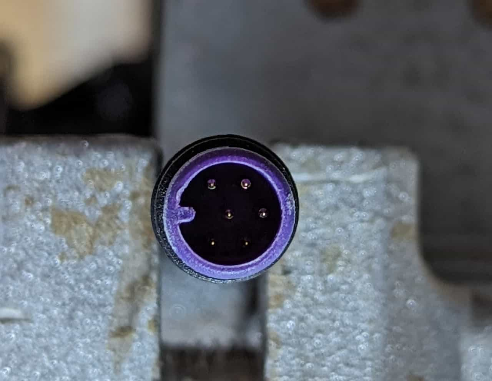
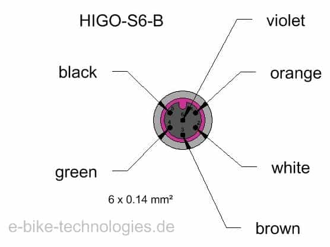

# Display

[Mobile Apps](/components/electrical/display/mobile-apps)

[User Manual](/components/electrical/display/display-user-manual)

[Teardown](/components/electrical/display/display-teardown)

[BLE Interface Documentation](/specifications/bluetooth-ble)

## Comodule Diamond Display

$195.00

* Model F0210007
* [FCC ID 2AQHSF0210007](https://electric.garden/comodule-ou-2aqhs/s-display-f0210007) - Electric Garden user manual, internal and external photos, and more
* Manufacturer Whitepapers

  + [Diamond Display: small device but huge effect](https://www.comodule.com/blog/display-s-small-device-huge-effect)
  + [Comodule Companion App](https://www.comodule.com/software)
* Cable: [Higo Mini B Male cable connector](https://www.higoconnector.com/products/z209bg-p-00-a0-1000/0999K#title), 6 Poles

### The display

### Display back

### [Primary harness](/components/electrical/primary-harness) connector

### [Primary harness](/components/electrical/primary-harness) connector

1. Signal 6
2. Signal 5
3. GND
4. CAN H
5. CAN L
6. Unused
