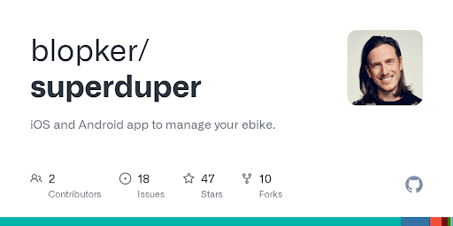
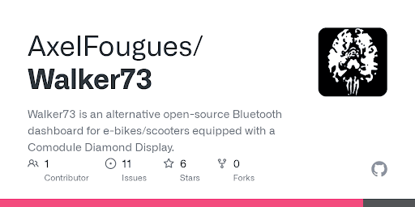
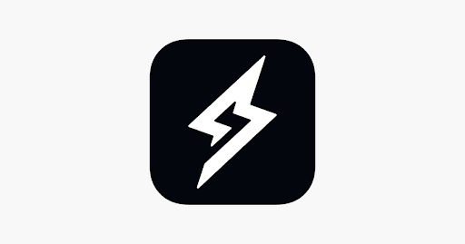

# Mobile Applications to connect to the display

## [SuperDuper](https://github.com/blopker/superduper)

* Open-source
* No account or internet connection is required
* Supports multiple bikes
* Includes most bike settings (US modes, light, PAS)
* Lock and auto-apply individual settings
* Lightweight and multi-platform

[Superduper - Apps on Google PlaySuper ebike controller](https://play.google.com/store/apps/details?id=io.kbl.superduper&hl=en&gl=US)

[Join the SuperDuper Controller betaAvailable on iOS](https://www.google.com/url?q=https%3A%2F%2Ftestflight.apple.com%2Fjoin%2FTl0UibRY&sa=D&sntz=1&usg=AOvVaw03ErrcSINfzL5hpKfRjYG9)

[GitHub - blopker/superduperContribute to blopker/superduper development by creating an account on GitHub.](https://www.google.com/url?q=https%3A%2F%2Fgithub.com%2Fblopker%2Fsuperduper&sa=D&sntz=1&usg=AOvVaw2BBTGXTcRMLCAVnsP_S6Rh)

## [Walker73](https://github.com/AxelFougues/Walker73)

* Open-source
* No account or internet connection is required
* Includes all bike settings (EU and US modes, light, PAS)
* Auto applies settings on start
* Metrics (battery level, voltage, pedal rpm, wheel rpm, speed, mode info, bike info, charge state, charge amps, odometer)
* Customizable values for moded bikes (wheel sizes, battery voltage, range)
* Panic EPAC mode revert feature for EU riders

[Walker 73 - Apps on Google PlayOpen source e-bike dashboard, no account, no internet, no locked features!](https://play.google.com/store/apps/details?id=com.AzApps.Walker73)

[GitHub - AxelFougues/Walker73: Walker73 is an alternative open-source Bluetooth dashboard for e-bikes/scooters equipped with a Comodule Diamond Display.](https://www.google.com/url?q=https%3A%2F%2Fgithub.com%2FAxelFougues%2FWalker73&sa=D&sntz=1&usg=AOvVaw2UYKIMyiRAT5QdLe04eN8V)

## [Official Super73 App](https://super73.com/pages/mobile-app)

* Requires registration
* Requires internet connexion
* Collects private data extensively through the Comodule framework
* Can debug and update the firmware

[SUPER73 App - Apps on Google PlayApp for Super73](https://play.google.com/store/apps/details?id=com.comodule.super)

[‎SUPER73‎The Super73 App will give you access to features such as Navigation, Tracking your rides, customizing your Dashboard, control of Lights and Pedal Assist Levels (PAS), access to Multi Class Multi Speed modes, and it provides a portal to Customer Service Support.
\*Continued use of GPS running in the…](https://www.google.com/url?q=https%3A%2F%2Fapps.apple.com%2Fus%2Fapp%2Fsuper73%2Fid1513155421&sa=D&sntz=1&usg=AOvVaw3xKBX52yn3SP57ONQ8aDV-)
