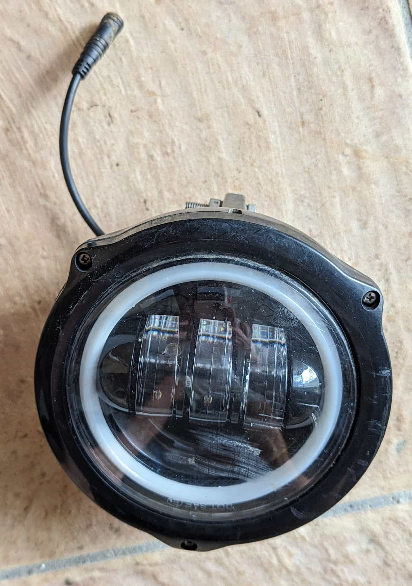
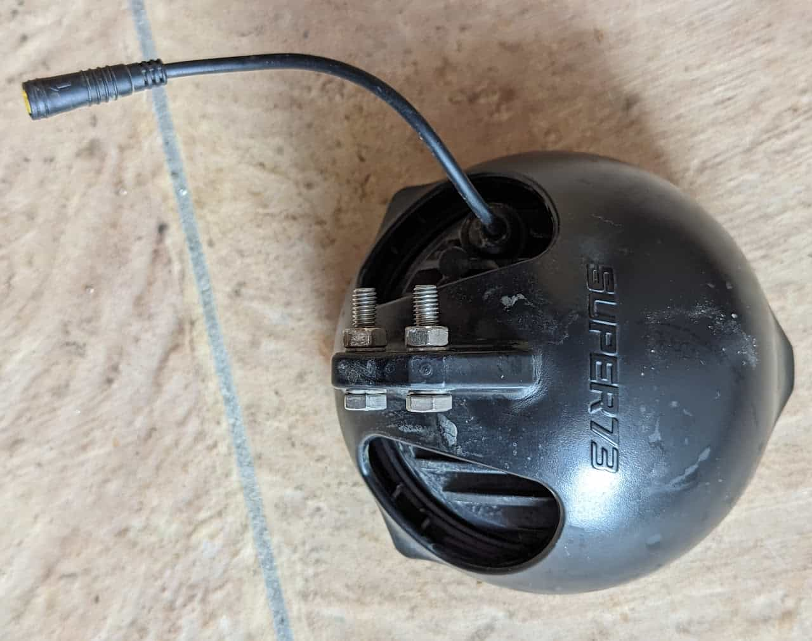
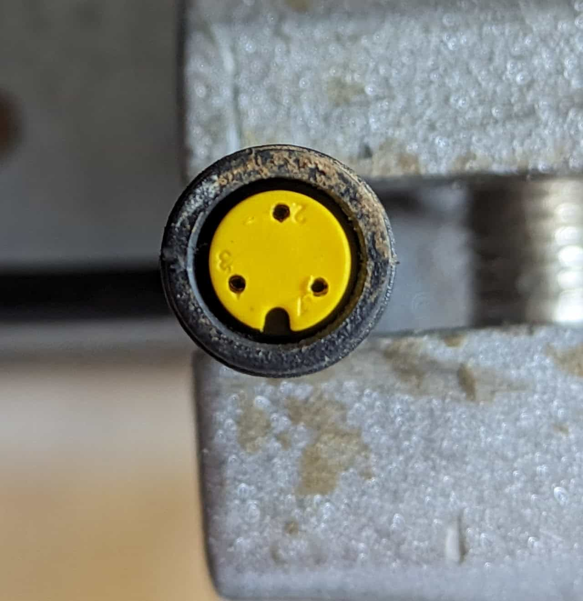
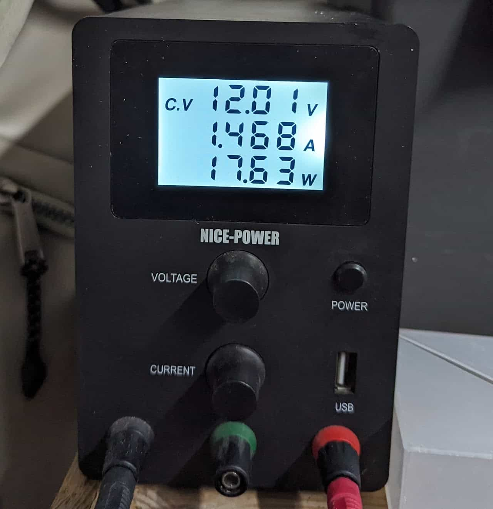

[S2 headlight](#s2-headlight)

[RX headlight](#rx-headlight)

## S2 headlight

Specs:

* 10 - 12V
* ~18W @ 12V
* LED

The headlight front

The headlight back

[12V Harness](/components/electrical/12v-harness) connector

Power draw

### [12V Harness](/components/electrical/12v-harness) connector

1. GND
2. Unknown
3. 12V

## RX headlight
