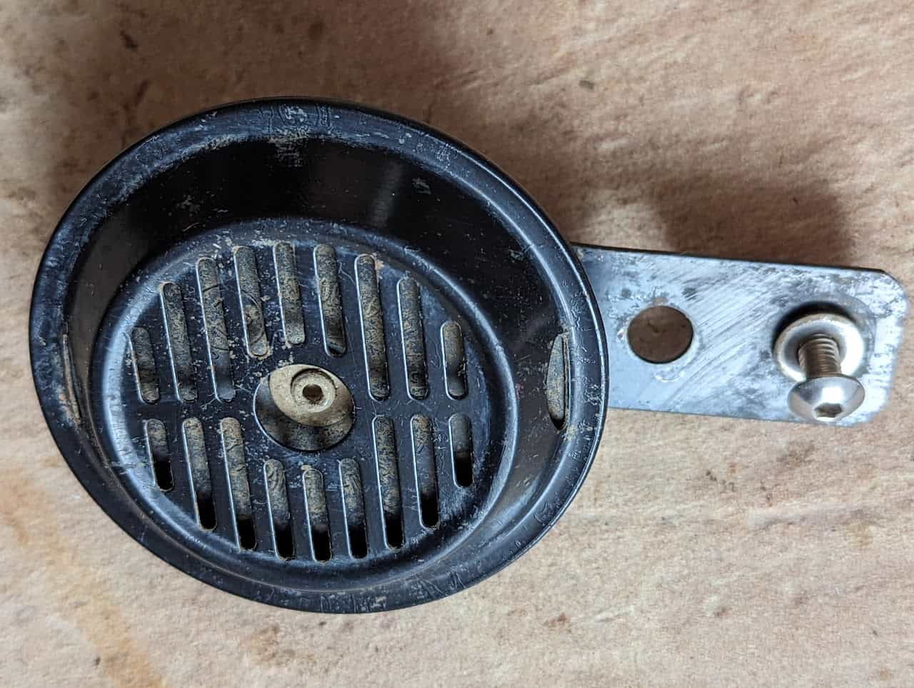
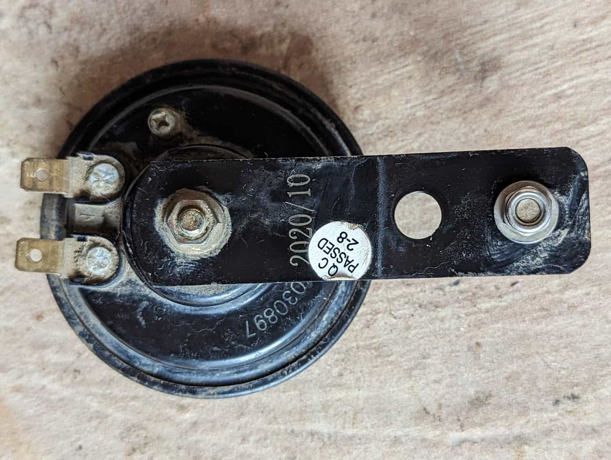

It honks!

It's a standard 12V motorcycle horn. The replacement bike's horn sounded like a strangled cat until I turned the adjustment screw first one way (went silent) then the other (sounded like a horn). You can replace them for less than $10.

<https://www.revzilla.com/common-tread/how-motorcycle-horns-work-and-how-to-fix-them> 

An adapter (see [Additional Cables/Adapters](/components/electrical/additional-cablesadaptors)) is used to connect the horn to the [12V Harness](/components/electrical/12v-harness).

The horn

The horn back
