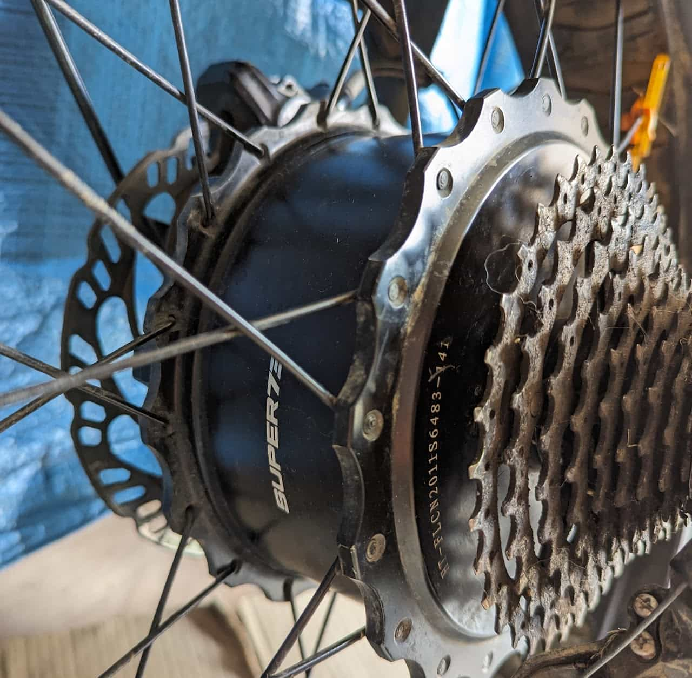
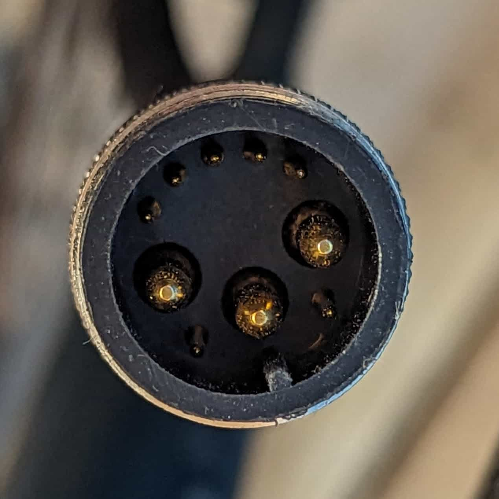
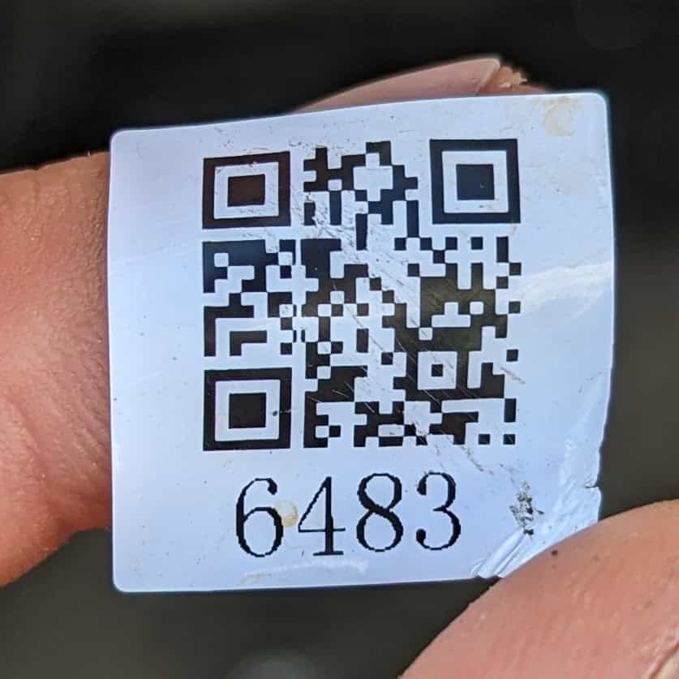
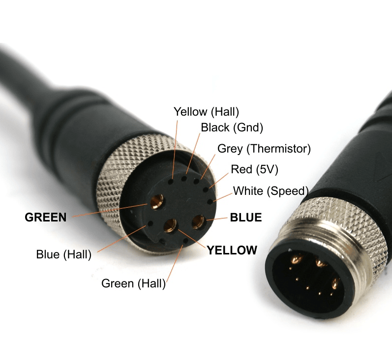

# Motor

[V2-3 Motor Teardown](/components/electrical/motor/v2-3-motor-teardown)

[Official Power Chart](#official-power-chart)

[S & R Series](#s-r-series)

[Z Miami](#z-miami)

[Z Adventure Series](#z-adventure-series)

[K1D](#k1d)

## Official Power Chart

Super73\_MotorPowerChart\_042423.pdf

## S & R Series

Info from the QR code sticker:

* Rated voltage: 48V
* RPM: 445 @ 48V

The motor

[Controller](/components/electrical/controller) connector

QR Sticker (EU S2)

### [Controller](/components/electrical/controller) connector

See image.

## Z Miami

* TBD

## Z Adventure Series

* TBD

## K1D

* TBD
