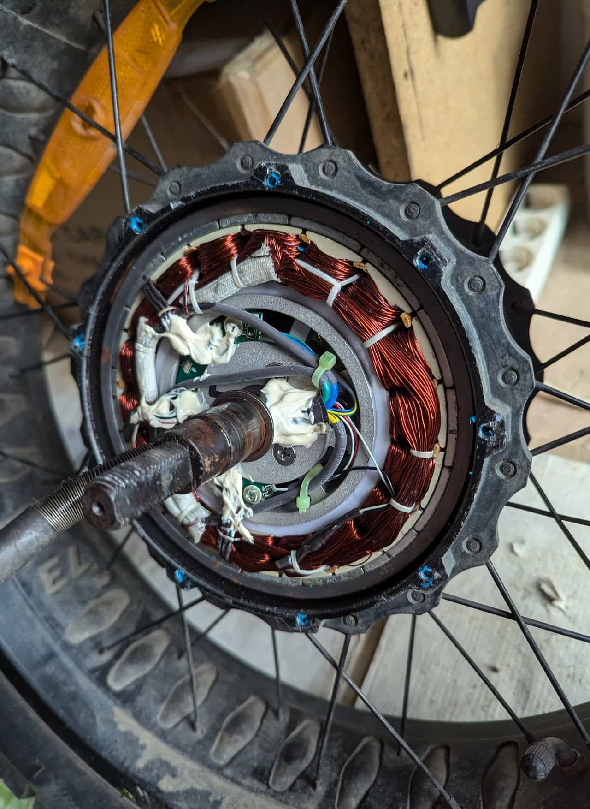
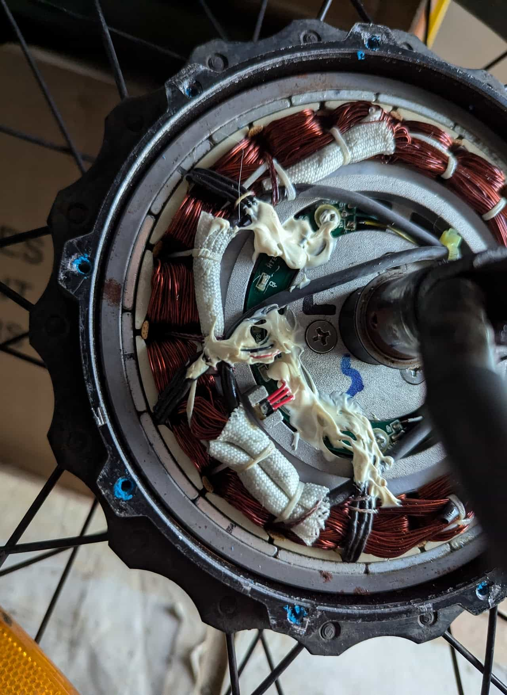
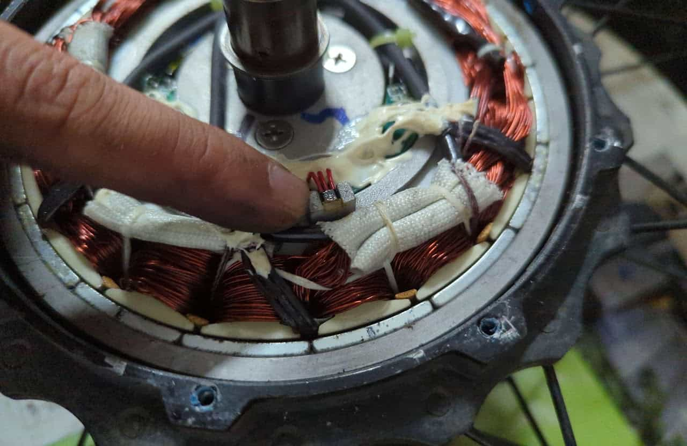
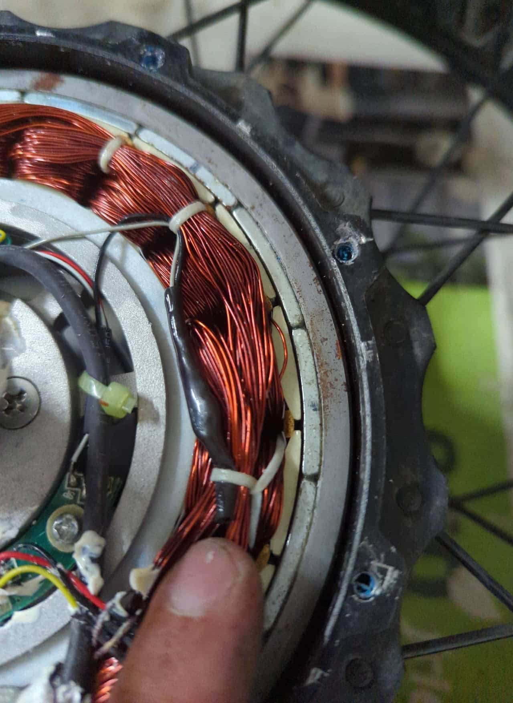
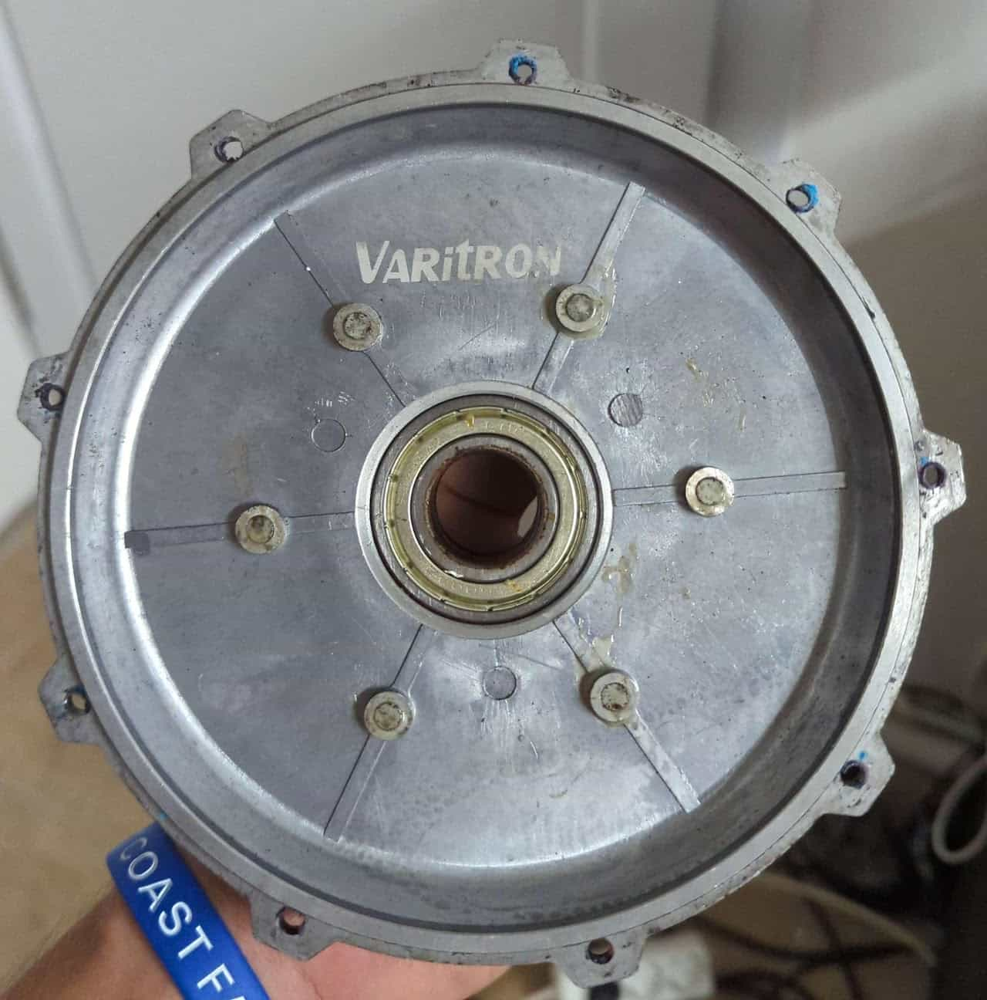

## Coil, wiring, hall sensors, pcb

Cables going into the axle.

Sensors PCB with original glue.

Extra hall sensor for speed measurement using the magnets on the cover plate.

Sensor PCB. Cleaned.

Thermal probe.

## Cover plate

It has 6 equidistant magnets on the inside that pass in front of an extra hall sensor to measure speed. It also has the brand Varitron.
