# Primary Harness

This harness links multiple 5V controls to the controller.

Warranty price: $19.75

* Input

  + Main Male Plug Connector - 12 poles

    1. <https://www.higoconnector.com/products/z1211ag-p-00-dw-1000/dZ99K#title>
* Output

  + 2 x Red Female 2 Poles Mini B Female Cable Connector - Brakes

    1. <https://www.higoconnector.com/products/z209bm-p-00-a0-1000/K999K#title>
  + 1 x Green 5 Poles Mini B Male Cable Connector - Horn & Turn Signals

    1. <https://www.higoconnector.com/products/z209bg-p-00-a0-1000/0999K#title>
  + 1 x Yellow 3 Poles Mini B Male Cable Connector - Throttle

    1. <https://www.higoconnector.com/products/z209bg-p-00-a0-1000/0999K#title>
  + 1 x Female 6 Poles - Comodule Diamond Display

    1. <https://www.higoconnector.com/products/z209bm-p-00-a0-1000/K999K#title>

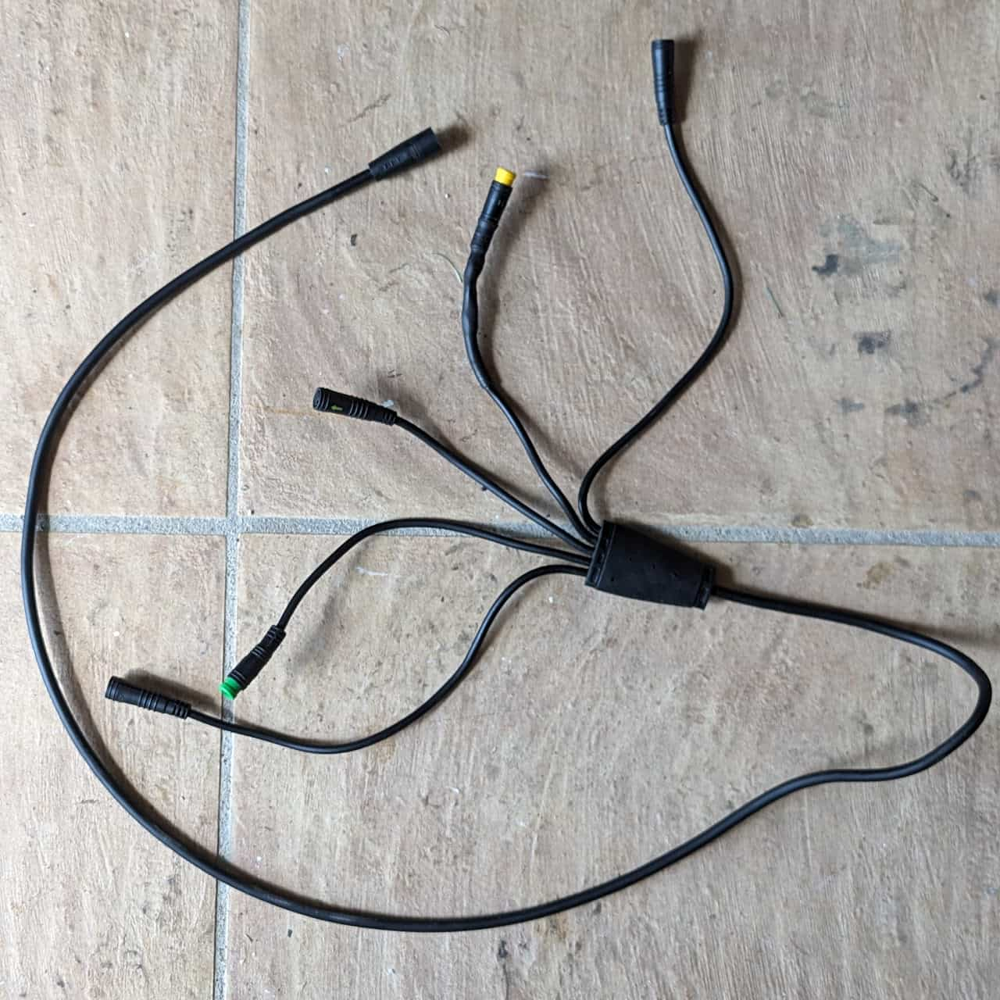

The primary harness

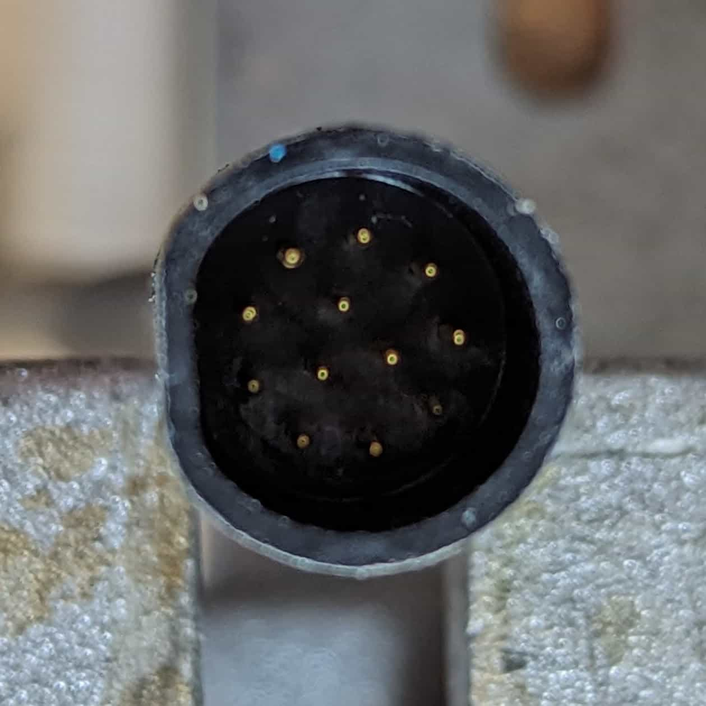

[Controller](/components/electrical/controller) connector

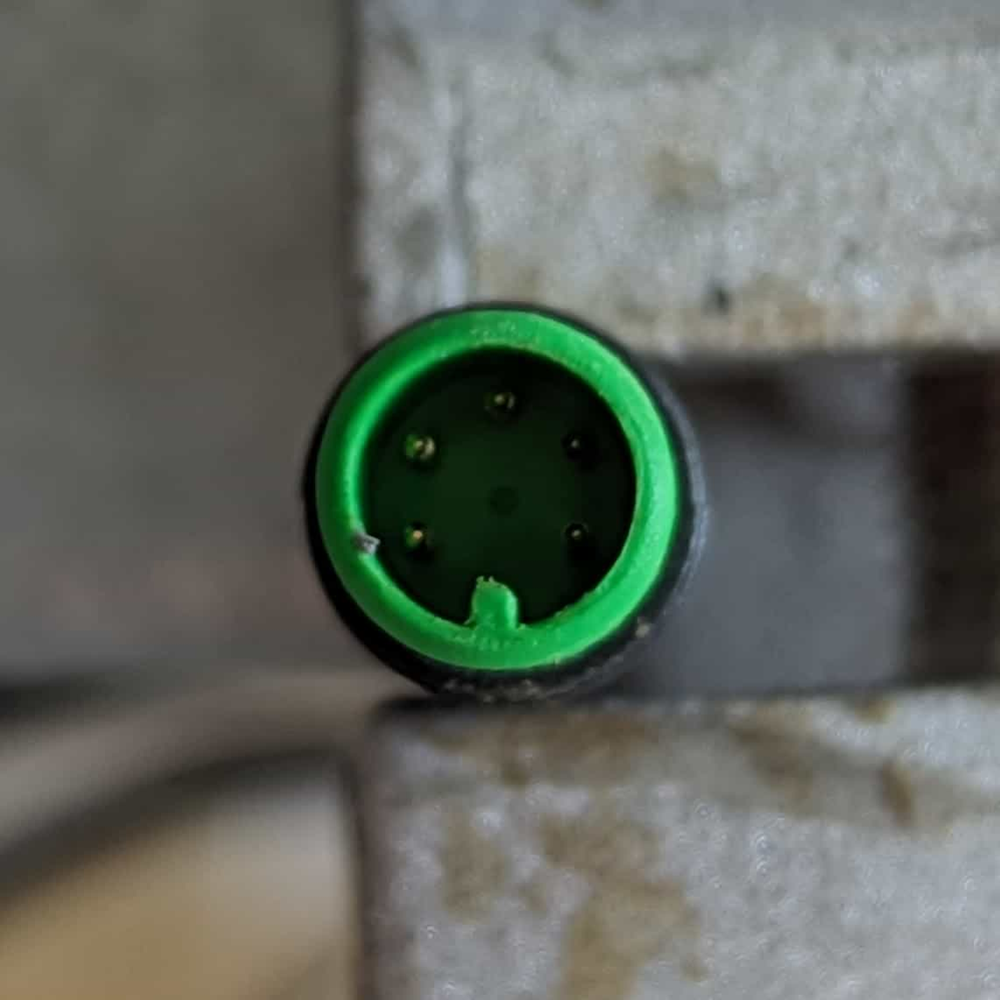

Horn trigger connector

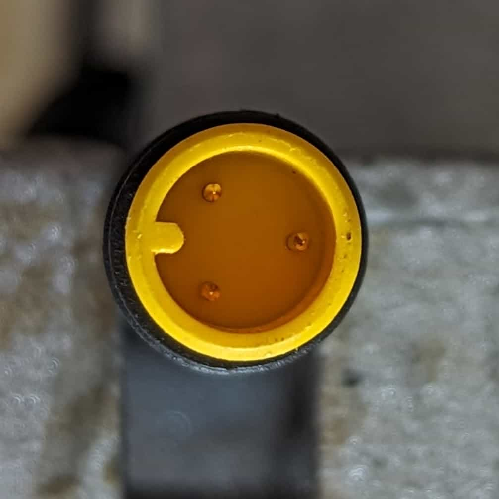

Throttle connector

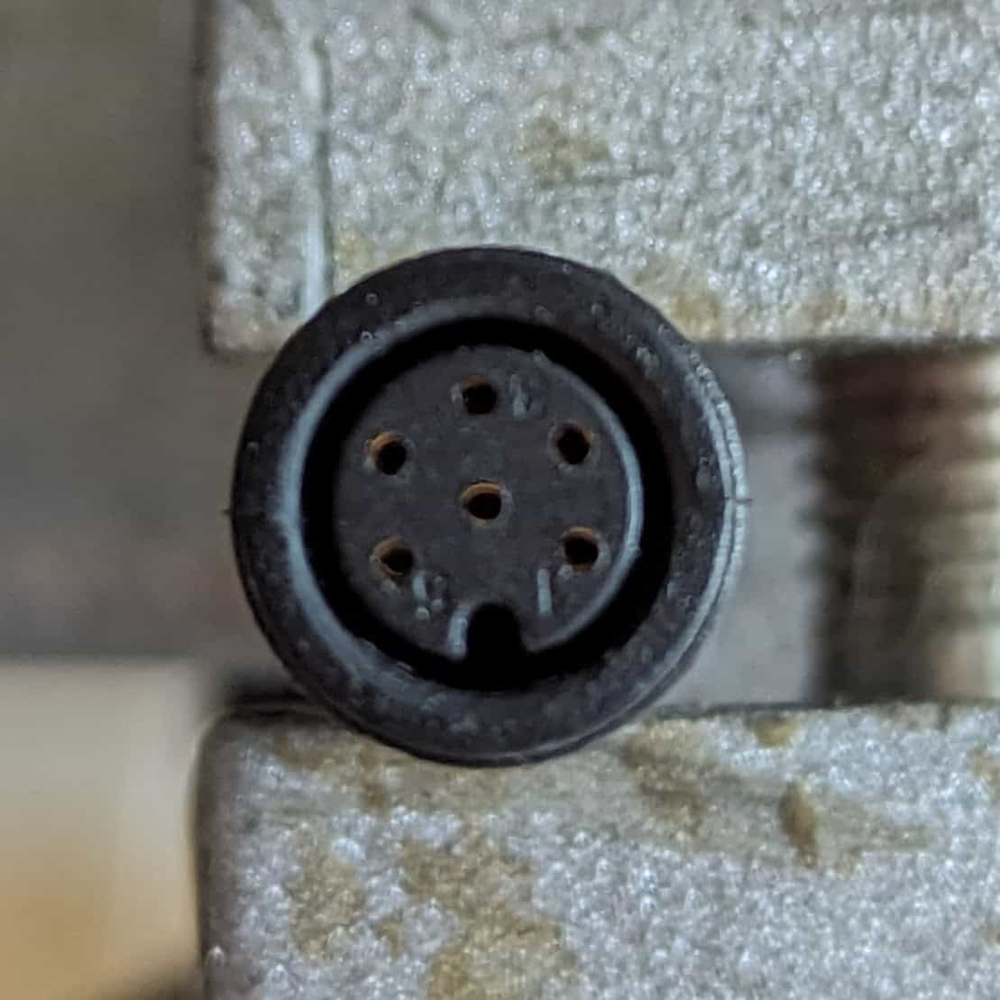

[Display](/components/electrical/display) connector

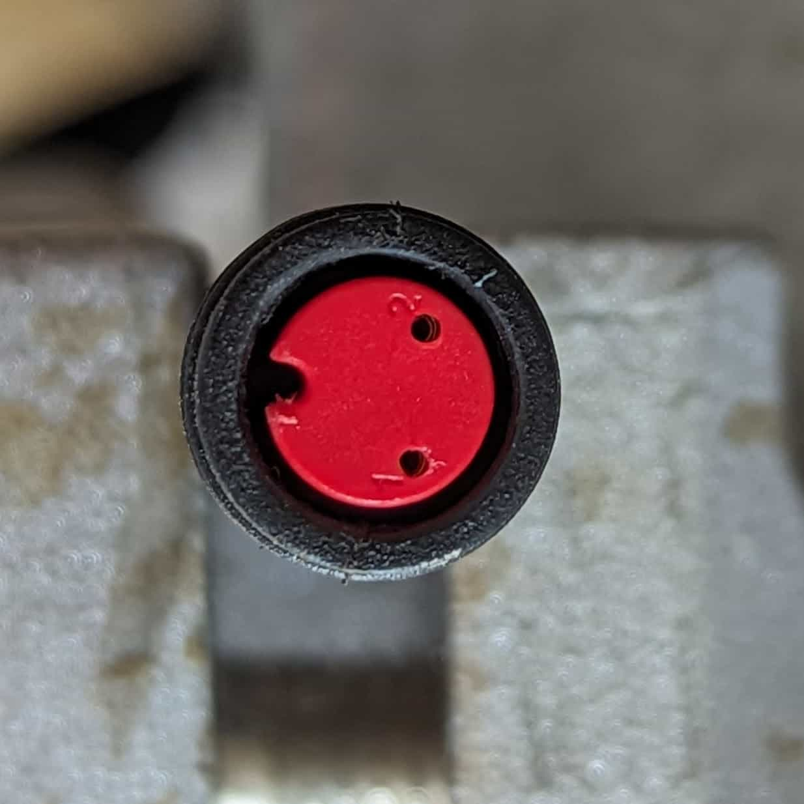

Brake trigger connectors (x2)

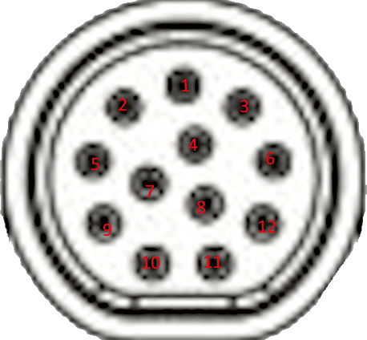

### [Controller](/components/electrical/controller) connector

1. CAN H - Display 4
2. Throttle signal - Throttle 2
3. Signal 1 - Horn 1
4. Signal 6 - Display 1
5. Signal 2 - Horn 2
6. CAN L - Display 5
7. 5V - Throttle 3
8. GND - Throttle 1 / Horn 5 / Display 3 / Brake 1
9. Signal 7 - Brake 2
10. Signal 3 - Horn 3
11. Signal 5 - Display 2
12. Signal 4 - Horn 4

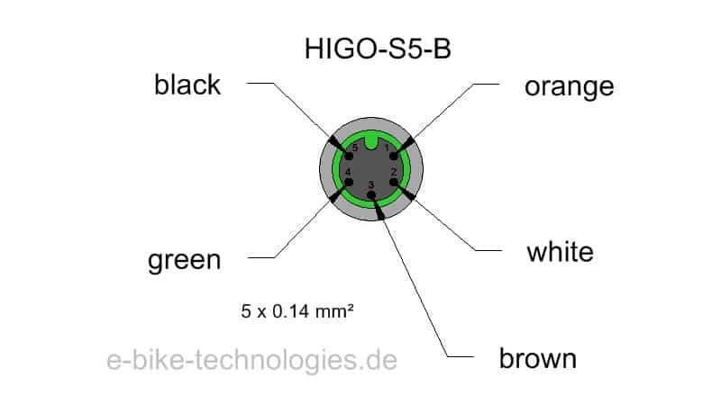

### Horn trigger connector

1. Signal 1
2. Signal 2
3. Signal 3
4. Signal 4
5. GND

### Throttle connector

1. GND
2. Signal
3. 5V

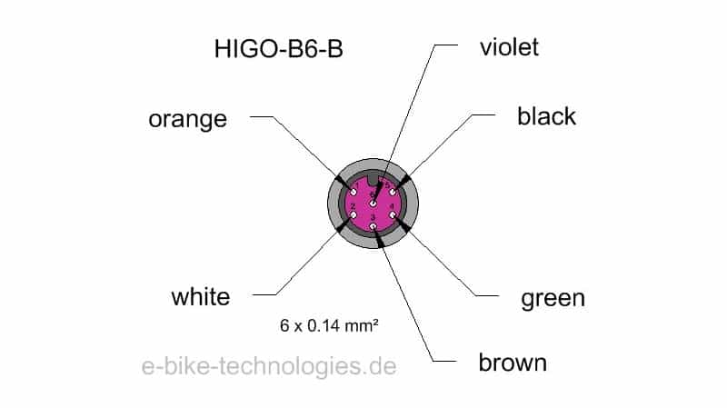

### Display connector

1. Signal 6
2. Signal 5
3. GND
4. CAN H
5. CAN L
6. Unused

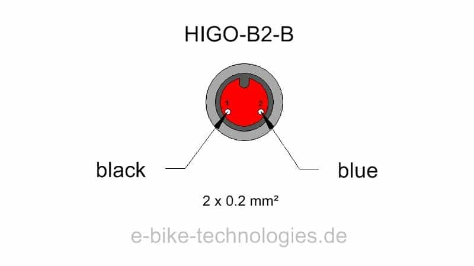

### Brake trigger connectors (x2)

1. GND
2. Signal 7

## Additional Images

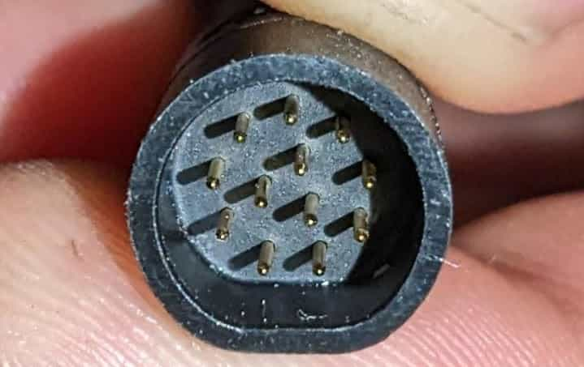

Detail of main 12 pole input.

Detail of Junction.

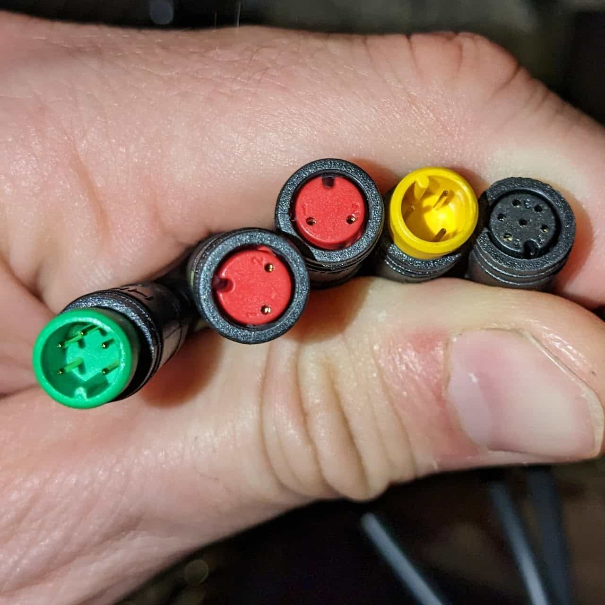

From the left: Signals, Brakes, Brakes, Throttle, Display

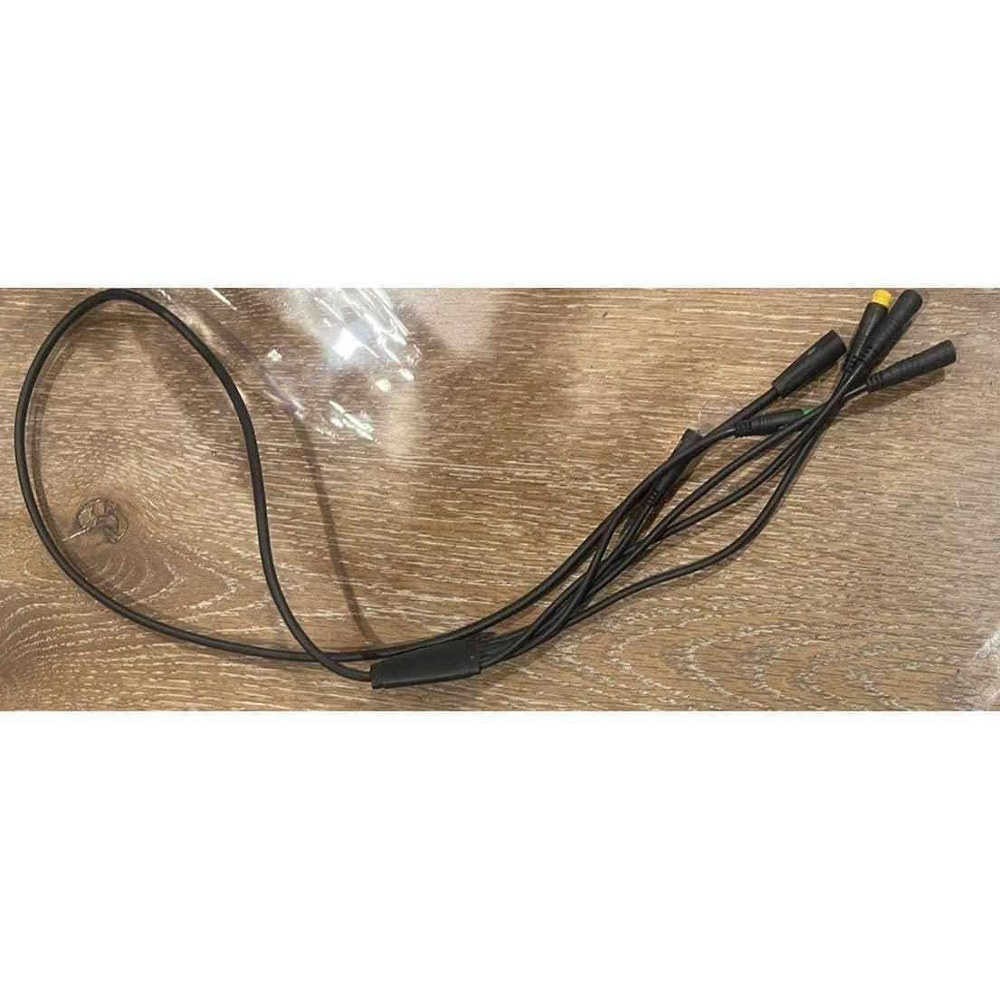

Super73 Primary Wiring Harness; image found on eBay.
