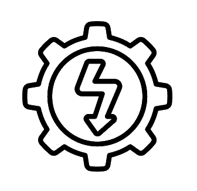

# Diagnostics

## Introduction

This page covers a few things you can try yourself if your Super 73 eBike is not working properly.   Consulting Super 73 support should usually be your first choice, but if support is too slow to respond, indicates you are out of warranty, or simply doesn't have an answer, these diagnostics may help.

WARNING: Many of the diagnostic steps provided here can be done safely by your average rider and without need of specialized tools.  But as always, exercise caution when working with the electrical system specifically.  High voltage Lithium-ion batteries are no joke, and mishandling the battery, the wiring, or any electrical components could result in severe injury or death.

Tools and supplies that may be required:

* Mechanical:

  + Allen Keys (Hex Keys)
  + Torx Screwdriver
  + Phillips head Screwdriver
  + Spanners / Wrench
  + Tyre Leavers
  + Cable Ties & Cable Tie Cutter
  + Chain Breaker
* Electrical:

  + Voltmeter
  + Higo/Juliet connectors of various pin count
  + Digital Clamp Meter
  + Oscilloscope
  + CAN sniffer

## Diagnostic Tree

* Power & Battery Check:

  + Bike Not Turning on:

    - Check if the battery power icon lights up.
    - Check the Battery Pins & Connector. Ensure that none of them are melted/burnt.
    - Is the battery a Super73 brand? (Except S1 which allows aftermarket batteries)
    - Check if the diamond display comes on.
    - Ensure the battery is fully seated in the battery bracket. The nose of the battery and bracket should be flush.
    - Reset the battery if necessary: remove it from the bike, turn it on, leave it on for 60 seconds, then put it back on the bike and try again.
    - Check if the cables under the seat is connected properly.

      * If none of the above resolves the issue, you will need to consult with a Super73 Specialist for a Controller/DC replacement
  + Battery Not Charging:

    - Ensure that wall socket has power.
    - Ensure that the Bike Battery is turned on.
    - Charging Block Light not working or Flashing Red:

      * You will need to consult with a Super73 Specialist for a Charger replacement

  

* Brake Check:

  + Brake Light not working (For RX-E and S2-E Models only):

    - Confirm the brake lever is not engaged. Consider disconnecting both brake lever sensors.
    - Note that activating the front light defaults to engaging the brake light on low, similar to a car.
  + Squealing Brakes:

    - If your brakes squeal, it may be beneficial to upgrade from a two-piston brake caliper to a four-piston type.
    - Additionally, installing new brake pads is recommended. Note that solely replacing pads often does not eliminate squealing.
  + Soft Brake Feel:

    - If your brakes feel soft or lack responsiveness, replacing them with new brake pads is highly advised.

* Auto-Engaging Brakes:

  + Check if nothing is pressing down lightly the brakes.
  + Adjust piston/brake pad alignment and hold brakes while reattaching to ensure proper function.

    - Alternatively, wait until all brake pads wear out to address auto-engaging brakes. (Not Recommended 👿)

  

* Speed Issues:

  + Can not exceed speed over 20 mph or 25 km/h:

    - Change Vehicle Modes to Mode 4 via

      * Super73 app (Settings -> Bike)

        + iOS: <https://apps.apple.com/us/app/super73/id1513155421>
        + Android: <https://play.google.com/store/apps/details?id=com.comodule.super>
      * SuperDuper app

        + iOS: <https://testflight.apple.com/join/Tl0UibRY>
        + Android: <https://play.google.com/store/apps/details?id=io.kbl.superduper>
    - Make sure the throttle was not partly depressed at the time of power on. 

      * Turn the battery off and on again and ensure the throttle is not depressed at startup.

* Throttle feels like its not getting its full power (cutting out feeling, Limp Mode)

  + Bike is on limp mode, This is normal when battery is roughly under 25%
  + Charging Battery to 100% will resolve this issue
* Throttle not working:

  + EU Bikes require to be on Mode 4 via the Super73 app (Settings -> Bike)
  + Double check if the brakes are not engaged.
  + Check if throttle is plugged in.

    - If none of the above resolves the issue, you will need to consult with a Super73 Specialist for a Throttle Replacement

  

* Error Codes:

* List of confirmed [Error Codes](/diagnostics/error-codes)
