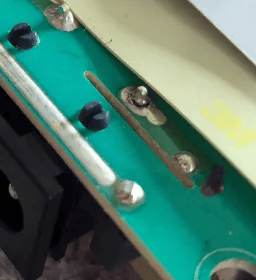

# Charger

## Broken solder joint on the 220V port

Cause: Wear from the movement of the port.

Easy fix:  Open the charger, identify the failure visually, and re-melt the joint. Possibly add some solder.

