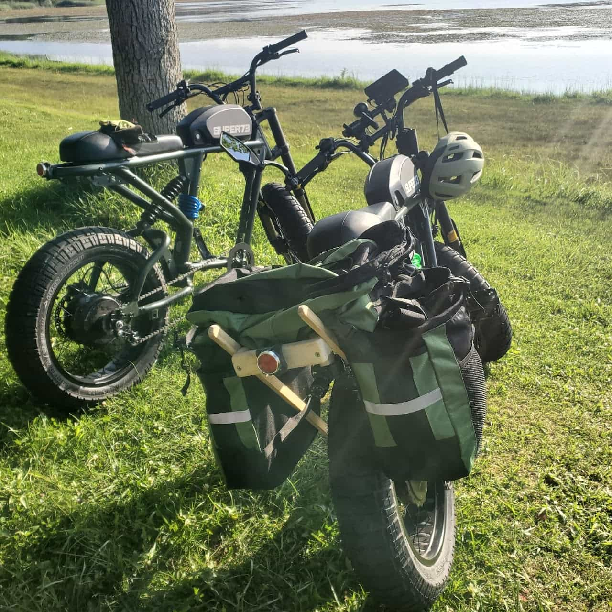
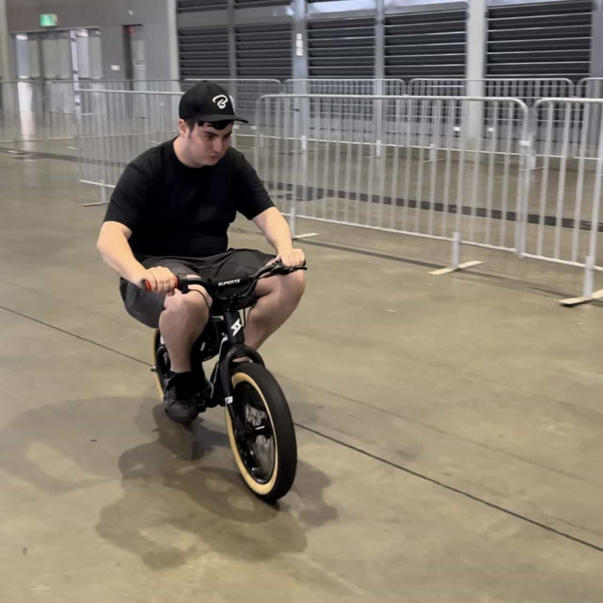

The Super73 Reverse Engineered project provides comprehensive service documentation for Super73's fat tire e-bikes. The initial focus will be on the R-series and S-series.

Super73 provides very minimal documentation; what exists is focused on use. Their limited warranty discourages modification or disassembly. Many parts are common but with proprietary connections, creating intentional incompatibilities.

This project aims to exercise the [right to repair](https://en.wikipedia.org/wiki/Right_to_repair) by guiding anyone with foundational bicycle knowledge willing to learn more and maintain their e-bike. The ability to repair and maintain extends the life and enjoyment of the e-bike, is economically and ecologically sound, and is incredibly satisfying.

The documentation will include specifications, instructions, photos, diagrams, explanations, theories, links to manufacturers, and findings from reverse engineering efforts.

We'll do our best to keep it current and accurate.

## Contact

Have a question or want to help with documentation? Join us on the [SuperDuper Discord server](https://discord.gg/STvgARZYaw), which has become the defacto Super73 Discord server.

## Contributors

Null Confluence

Axel Fougues

BaconCentric

Bamuel
