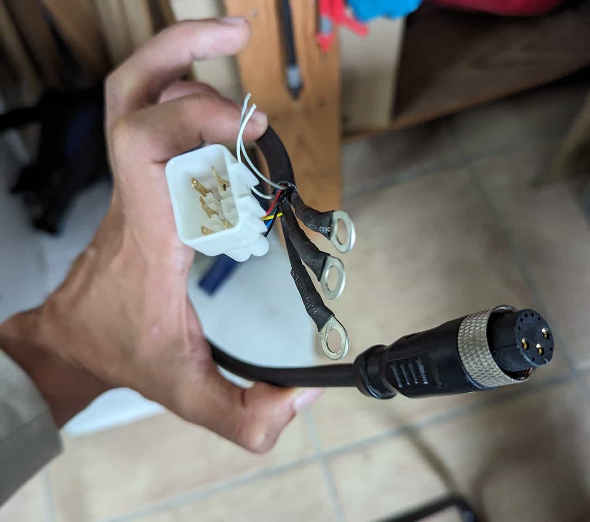
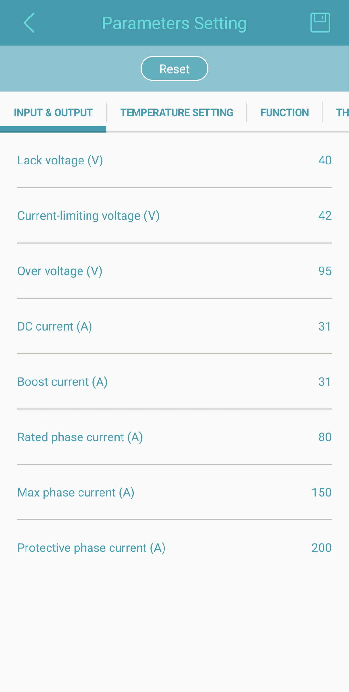
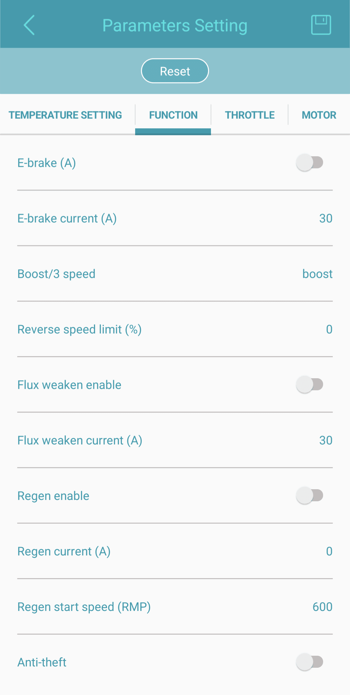
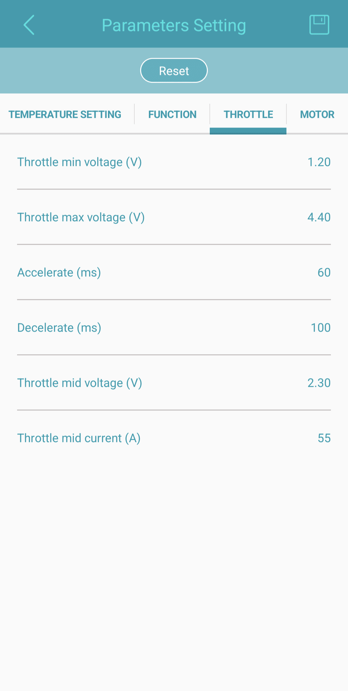
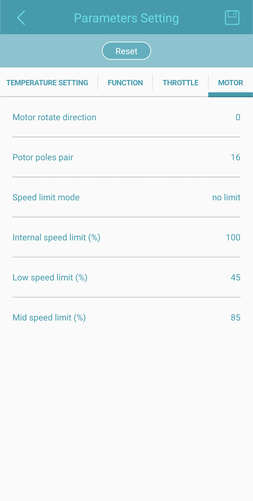

# Sabvoton Controllers

## Using a Sabvoton controller with stock Super73 battery and motor.

[Preface](#preface)

[Parts](#parts)

[Minimal Setup](#minimal-setup)

[Assembly](#assembly)

[Wiring Diagram (WIP)](#wiring-diagram-wip)

[Minimal Setup](#minimal-setup-1)

[Motor adaptor](#motor-adaptor)

[Battery adaptor](#battery-adaptor)

[Primary Harness / Throttle adaptor](#primary-harness-throttle-adaptor)

[Tuning](#tuning)

[Sabvoton User Manual](#sabvoton-user-manual)

[Sabvoton App Manual](#sabvoton-app-manual)

[The Stock++ Setup](#the-stock-setup)

[App Settings Clarifications](#app-settings-clarifications)

[DC current and Boost current:](#dc-current-and-boost-current)

[Rated phase current:](#rated-phase-current)

[Max phase current:](#max-phase-current)

[Protective phase current:](#protective-phase-current)

# Preface

In this mod, the default controller is replaced with a Sabvoton MQCON [SVMC7245](https://sabvoton.net/products/sabvoton-svmc7245-72v1500w-45a-brushless-dc-motor-programmable-controller-for-ebike-bicycle), [SVMC7260](https://sabvoton.net/products/svmc7260), or higher from the SVMC series. These controllers can run fine with the stock battery and motor, making them a nice replacement. They can also handle batteries from 36V to 72V and more powerful motors, making your bike ready for future upgrades. 

Pros:

* Fully customizable power, throttle, and optimizations like flux weakening, over Bluetooth or USB
* Much better performance than the stock controller, with stock components and reasonable settings
* Future-proof, compatible with all batteries and all motors
* Relatively cheap

Cons:

* Connector replacement needed (involves cutting wires and soldering new connectors or making adaptors)
* Requires a separate 12V module for lights, horn
* It has the power to fry your other components if you're being silly with your settings

# Parts

### Minimal Setup

1. The actual controller.  For this write-up, a Sabvoton SVMC7260 (60A) was bought on Aliexpress from a trusted seller.  A 7245 (45A) would technically be sufficient but it is good practice to over-spec your controller and consider long-term motor upgrades. Anything higher than 60A is probably overkill but should work just as well.
2. Wires and connectors. I chose to keep all my stock components intact (I recommend doing so).  So I made adaptors that match my stock components on one side and the new controller on the other. Clean and swappable. For that, you will need some higo wires to cut and splice with whatever connectors your Sabvoton has (order the controller first to be sure what connectors it has). If you have an old Super73 [controller](/components/electrical/controller) you can retrieve the cables from it. Otherwise, you might have to do some shopping:

   * For the motor adaptor:

     + A  Higo motor cable with a female [HG-F.M-L1019A](https://www.higocon.com/motor-connector/hg-fm-l1019a.html) plug (Aliexpress)
     + A 6-pin connector corresponding to your controller's motor hall connector
     + 3 ring cable lugs for 3mm wire with adequate diameter for your controller's screw ports.
   * For the battery adaptor

     + A Higo battery cable with a male [L615AG P 00 DC 1000](https://www.higoconnector.com/products/l615ag-p-00-dc-1000/bw99K#title) plug (Aliexpress maybe)
     + 3 ring cable lugs for 3mm wire with adequate diameter for your controller's screw ports.
   * For the primary harness adaptor:

     + A Higo cable with a 12-pin [CONNECTOR-F.S-Z1211](https://www.eworldtrade.com/pd/ansonyincompany/higo-connector-f-s/806737/)  (hard to find unless you scavenge it from a dead stock controller).  If you really can't find it then get a 3-pin higo cable and connect the throttle directly without using the [primary harness](/components/electrical/primary-harness) (see below).

# Assembly

## Wiring Diagram (WIP)

## Minimal Setup

All the wiring for each component is described in excruciating detail on our [Components](/components) pages and the Sabvoton's is described in their user manual so you should be able to match them. But just to be sure let's go over the bare minimum you need to ride (motor, battery, throttle):

Motor adaptor

### Motor adaptor

A motor harness that will plug into [the motor's 10-pin connector](https://sites.google.com/view/super73-reverse-engineering/components/electrical/motor) on one side. On the other, it will plug into the controller's 5-pin hall sensor connector and the three green, blue, and yellow phases. A grey and a white wire (speed and thermal) won't be used.

### Battery adaptor

A battery harness that plugs into [the battery cradle's 6-pin connector](https://sites.google.com/view/super73-reverse-engineering/components/electrical/battery-cradle) on one side. On the other the 4 small wires are unused, the positive and negative go to the red and black ports on the controller.

### Primary Harness / Throttle adaptor

An adaptor for the primary harness. On one side it connects to [the primary harnesse's 12-pin input](https://sites.google.com/view/super73-reverse-engineering/components/electrical/primary-harness). On the other side, we only use the three throttle wires and plug them into the throttle connector on the controller. The 12-pin connector can be hard to find while 3-pin higo wires are common. You can absolutely skip the primary harness and make a simple adaptor going straight to the throttle.

These three adaptors are the minimum requirement to have a running setup. You can keep going with optional things like brakes, PAS, etc...  I will be updating the wiring diagram as I do.

# Tuning

Follow the steps in the Sabvoton App manual to connect to your controller over Bluetooth and perform an offset angle test with a "given current" of 15A.

Then you can refer to these setups for the settings (these are subject to change as I keep tweaking and input is welcome):

SabvotonManual.pdf

## Sabvoton User Manual

SbvotonAppManual.pdf

## Sabvoton App Manual

## The Stock++ Setup

Goal: A safe setup, best performance with no risks of overheating, shutdowns, or errors. At least as good as stock.

In practice: 

Pros:

* Much improved torque, better acceleration, and less slowing down uphill.
* Slight increase in top speed.
* Tested on very long and steep rides with no significant motor heat.

Cons (needed tweaks) :

* Occasional motor stutter when starting from still (possibly from motor settings or throttle thresholds).
* Acceleration is sometimes too aggressive (unwanted wheelies when starting uphill).
* Some delay when accelerating while running (most likely throttle settings).
* Very rare overcurrent shutdowns when over 2000W for some time

# App Settings Clarifications

This is some complementary information to the Sabvoton app manual available above.

Main reference: [Endless-sphere: For Sabvoton sine wave motor controller users](https://endless-sphere.com/sphere/threads/for-sabvoton-sine-wave-motor-controller-users.56378/#:~:text=The%20rated%20phase%20current%20means,%2C%20and%20re%2Dpower%20up.) 

### DC current and Boost current:

These are the maximum currents drawn from the battery. If Function>Boost/3 Speed is set to "boost" then Boost current will be used always. If it's set to something else then DC current will be the normal and Boost current will be used when triggered. 

### Rated phase current:

This is phase current, not battery current and the values are substantially higher. The phase settings are security limits, the DC current is the actual setting that makes a difference. If the phase current exceeds this value for more than 3 minutes the controller will shut down or throw a 20H error, Either way, it should be unpowered and depowered before starting again.

2-3 x DC current seems to be right for this setting.

### Max phase current:

About double the Rated phase current. If the phase current exceeds this value for more than 60 seconds the controller will shut down or throw a 20H error, Either way, it should be unpowered and depowered before starting again.

### Protective phase current:

The controller will immediately shut down if this limit is reached.
