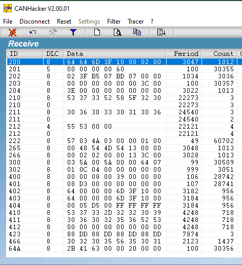

## Contents

[What is a CAN Bus?](#what-is-a-can-bus)

[CAN-Capable Components on an S73 Bike](#can-capable-components-on-an-s73-bike)

[S73 CAN Implementation](#s73-can-implementation)

[CAN "Sniffing"](#can-sniffing)

[S73 CAN Traffic Analysis](#s73-can-traffic-analysis)

## What is a CAN Bus?

A Controller Area Network (CAN) bus provides a simple way for data-enabled components ("nodes"), typically in a vehicle or in industrial equipment, to exchange data over short distances with minimal wiring, reduced component interface cost, and without requiring any network management devices (e.g. routers).

More detail on how a CAN bus works can be found at this Wikipedia page: [CAN bus](https://en.wikipedia.org/wiki/CAN_bus). 

Super 73 bikes (with the possible exception of the S1  and OG models) utilize a CAN bus to exchange data between its data-enabled bike components such as the controller, battery, and display.

Source: Wikipedia "CAN Bus" article (linked above)

## CAN-Capable Components on an S73 Bike

On an S73 bike, the CAN-capable data-enabled components are:

* [Display](/components/electrical/display) - sends drive mode (class), headlamp state, Pedal Assist Sensitivity (PAS) level, passes OTA firmware updates from app to controller, etc.
* [Battery](/components/electrical/battery) - sends battery charge level, charging status, battery voltage, current drain (or charge), temperature, battery serial #, etc.
* [Controller](/components/electrical/controller) - sends data like ground speed, brake status, odometer, pedal cadence, throttle position, motor current, limp mode, model code, version, etc.
* [12v Accessory Module](/components/electrical/12v-module) - listens for lighting status data, converts 48v battery power to 12v and feeds power to the bike's lighting when required.

All other S73 components (at the time of this writing) are not data-enabled, including the [hub motor](/components/electrical/motor), [headlight](/components/electrical/headlights), [taillight](/components/electrical/brake-lights), [horn](/components/electrical/horn), brake sw, throttle, and cadence or torque sensor.  These components are wired via analog circuits directly to one of the data-enabled components (typically the controller) which then digitizes the value or state and (generally but not always) broadcasts that info in a frame on the CAN bus.

  

As an example...

1. The bike's wheel rotation rate is sensed in the wheel hub motor with a sensor, which is wired via an analog circuit to the controller, located under the seat.
2. The controller converts this analog rotation rate signal into a digital value representing bike ground speed and broadcasts this speed (among other data) over the CAN bus 10 times per second in Frame ID #201.
3. Meanwhile the display (mounted on the handlebars) watches for Frame ID #201 on the CAN bus and when it sees that frame, it extracts the bike speed from it and updates the speed screen of the display.

Many other data parameters are passed between the data-enabled components this way, using 30 or so different frame IDs, some sent more frequently (e.g. 20x per second for throttle position) and some less frequently (every 3 or 4 seconds e.g. firmware version, battery temperature, etc), and some are sent only once for each battery power cycle (e.g. the shutdown frame).

## S73 CAN Implementation

The CAN bus is implemented via 2 wires, called "CAN H(igh)" and "CAN L(ow)".  All S73 components that use the CAN bus support these two wiring connections.  You can browse the pages for the data-enabled components above to see which connector pins carry the two CAN wires at each component.

The version of CAN implemented on S73 bikes is "CAN 2.0A", so the CAN frames on an S73 use the standard 11 bit identifier and max 8 Byte payload size.

Lower frame numbers are given higher priority when multiple nodes are competing for network bandwidth.   On an S73, frame IDs are allocated thusly:

* 200-299 Real-time bike controls, inputs, and stats like throttle, ground speed, brake status, motor power levels.  These frames are generally sent by the controller.
* 300-399 User preferences such as drive mode, PAS level, headlamp on/off.  These frames are generally sent by the display.
* 400-499 Battery stats such as state of charge, voltage, current, temperature, serial #, etc.  These frames are sent by the battery's internal Battery Management System (BMS) board.
* 64a, 74a (some oddball frames whose purpose we haven't decoded yet)

The CAN 2.0 bus protocol allows different network "speeds".  S73 chose a CAN bus speed of 250 kbit/s.

Source:  Wikipedia "CAN Bus" article (linked above)

## CAN "Sniffing"

A "sniffer" is a tool which shows the content of network traffic.  Sniffing requires specific hardware (to physically connect to the bike's network) and software (to visualize the data - see example to the right).  To use such a tool you will need to know which wires in the bike's harness carry the CAN bus (mentioned above) as well as the bus speed. 

There are many resources on the Internet for building a CAN sniffer, as this is of interest to many auto enthusiasts (almost all automobiles implement one or more CAN networks) but they work equally well on an e-Bike that implements CAN.  We have implemented a couple sniffers for this project and will link to the how-to instructions at a future date.

When viewing a CAN sniffer "trace", you will note the payload "Data" bytes (center of the image to the right) appear in hexadecimal notation.  Sometimes these hex values represent a numerical quantity (like voltage), sometimes a boolean state (on/off), sometimes text (using ASCII coding).

Multiple different parameters may be captured in a single frame.  Some numerical values use a single byte, others may use multiple bytes when greater than 8-bit precision is required (S73 uses small-endian ordering).  And some text strings may span multiple frames (such as the battery 16-character serial number spanning frames #410 and 411).

For an analysis of the data found in S73 CAN frames, see below.

"CANHacker" trace from bench test of an S73 CAN bus

## S73 CAN Traffic Analysis

Below is a spreadsheet documenting our analysis of the various CAN bus frames used on an S73 bike.   For easier viewing and scrolling, hover over the sheet below until the grey square icon appears at top right and then click it to open the sheet in a separate tab. 

Super 73 does not provide this level (or any level, really) of documentation on their bikes, so this was reverse engineered using a CAN sniffer and making some educated guesses by observing bike actions vs resulting data changes in the CAN data.  This is a work in progress.

[S73 CAN Traffic Analysis Sheet](https://docs.google.com/spreadsheets/d/1_4yek2lQ8dgjGym1Y8BURLcmWUYbLRsLaRuLpYjaGt8/edit?gid=1335315167#gid=1335315167)
