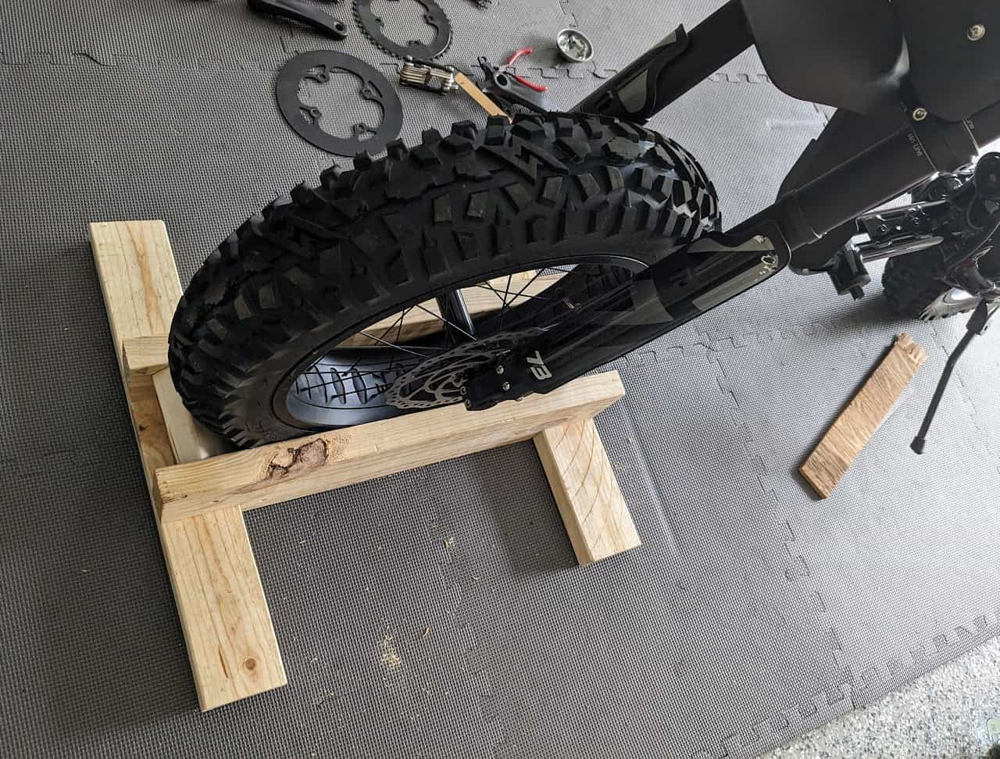
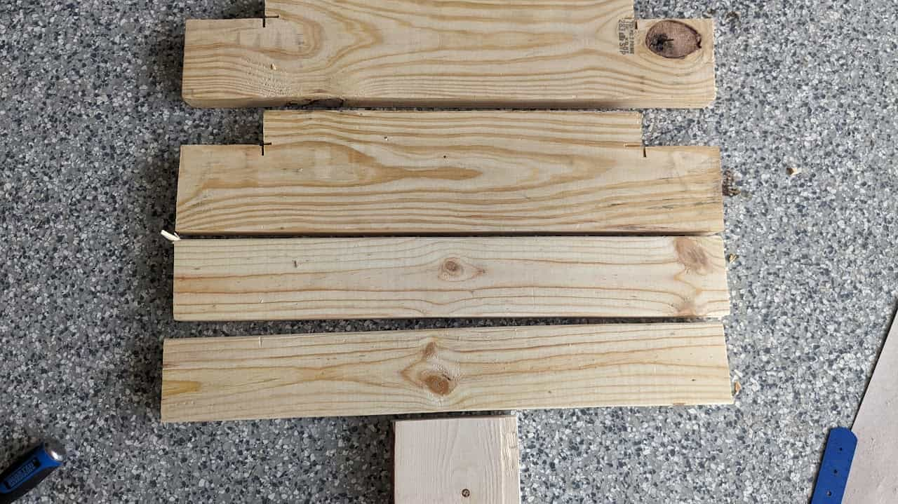
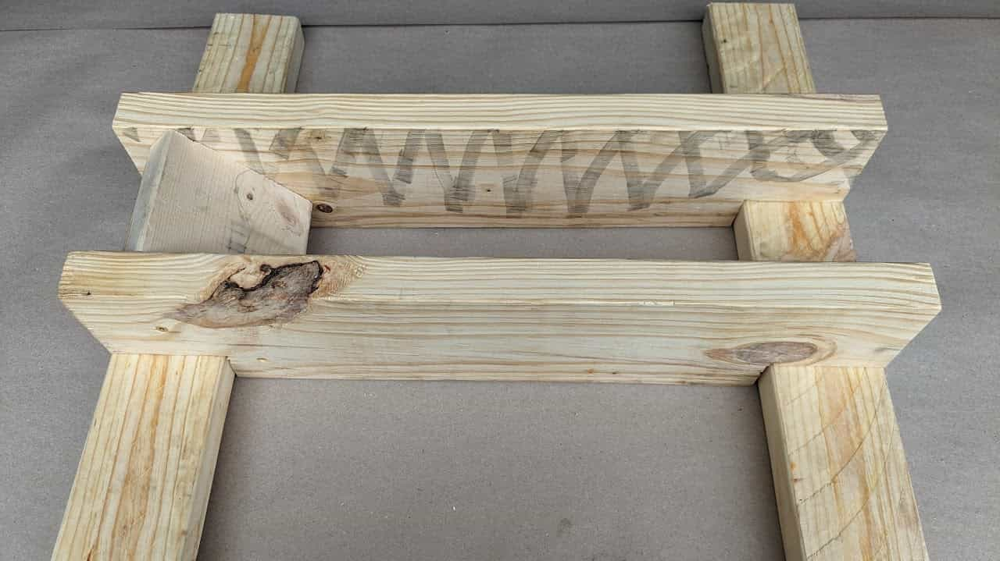
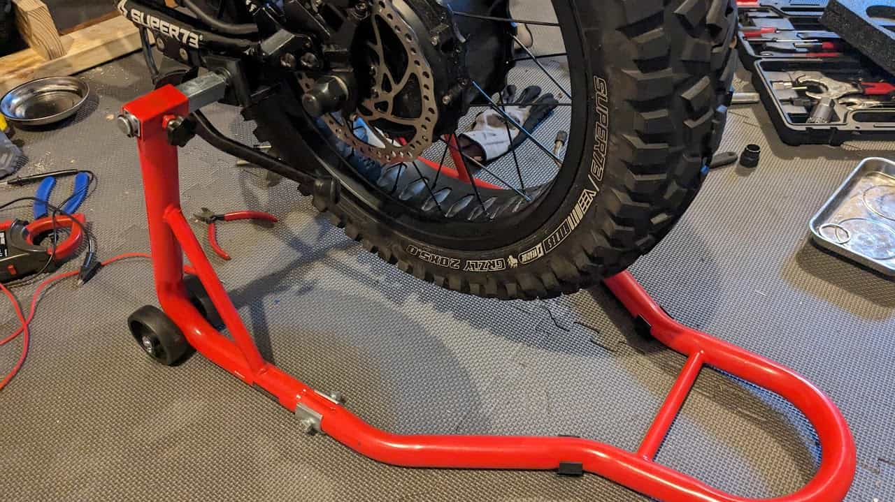
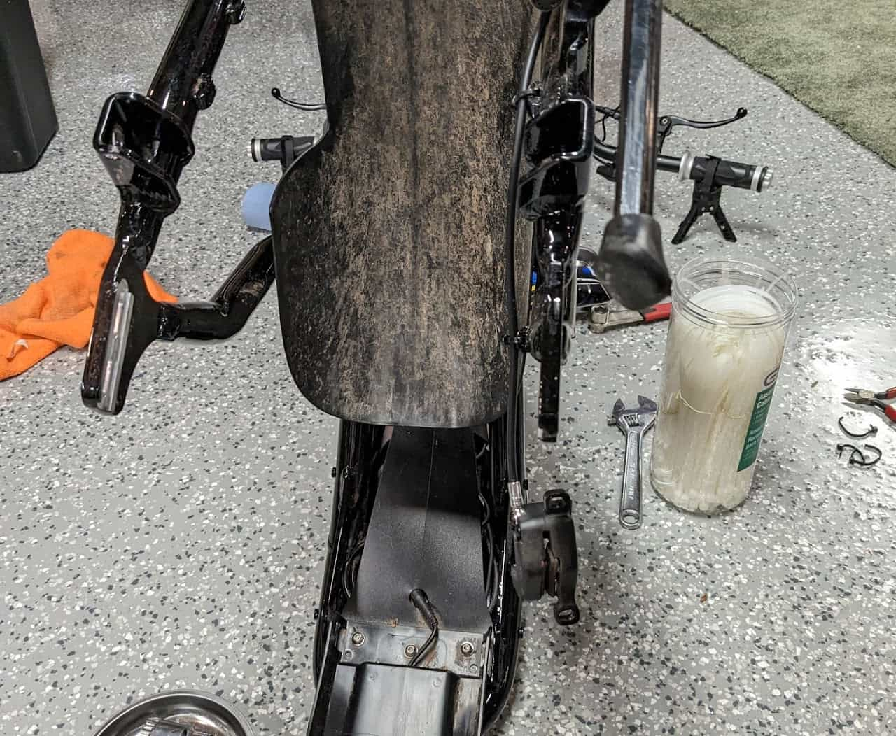
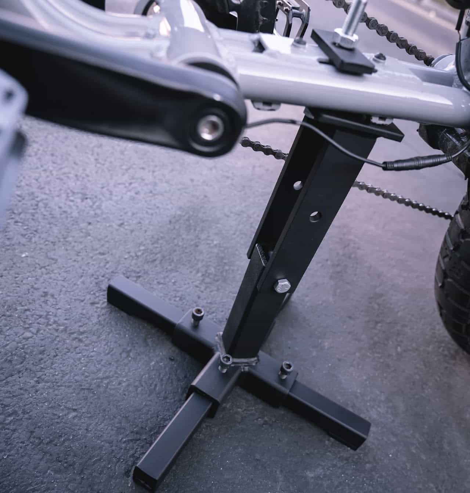

# Super73 Work Stand

With a custom frame and weighing 84 pounds, the Super73 RX Mojave is, at best, awkward to work on. Logistically, there are more similarities to a motorcycle or dirt bike than to a bicycle.

Traditional bicycle stands are not suitable for several reasons. There's no seat post, so you can't clamp there. The double-tubed frame is too wide to clamp onto. The weight exceeds the limits of most stands.

Due to the size and some wiring underneath, you can't use a milk crate or similar center stand. Also, there's a sticker with a QR code and serial number on the bottom bracket that, if damaged, could trigger an exclusion from the limited warranty. While this is likely aimed at invalidating stolen bikes, a center stand could damage the sticker.

If you want to work on a Super73 hub motor, changing tires, etc., put that thing on a milk crate. Keep it simple.

Let's explore some maintenance and work stand options for Super73 e-bikes.

# DIY Super73 Front Wheel Stand

After researching multiple commercial solutions, I decided it would be better to build than buy. I looked at several different designs and created a hybrid with my modifications.

A 2x4 and 2x6 and a couple of screws created a custom front wheel holder that locks the e-bike into position for maintenance and storage.

* I used a 2x6 for the vertical piece to compensate for the thicker tire
* I put a small piece of 2x4 at the front to provide a stop while allowing removal from the rear
* I notched the 2x6 so the 2x4 cross-pieces could be flush with the bottom of the 2x6, providing a stable foundation.

### Cut List

* 2 x 2x4 x 24" length (lays flat on the floor)
* 2 x 2x6 x 24" length (holds tire)

  + Remove 3½" x 1½" notches on the bottom side
* 1 x 2x4 x 4½" length (chock and spreader)
* 12 x 2" deck screws (I counter-sunk)

## Cut Pieces

This was not a precision build; I just used a circular saw.

## Assembled Stand

I will probably spray paint it black at some point.

# Donext Motorcycle Stand

<https://www.amazon.com/dp/B08L4NWZNX>

Made from strong and sturdy steel. Exquisite design added strength and stability. The 850 LB motorcycle stand is suitable for most motorcycles... A great helper in your garage work.

While I could have built a rear stand, I wanted to save space and have a more flexible solution. There are several very similar paddock/swingarm stands in the same price range. I purchased mine used from Amazon Warehouse; other than a missing washer, it worked.

I've only used the "L Type" adapter, which are rubber and steel L-shaped holders that I put under the foot peg mounts.

# Handlebar Jack

<https://www.handlebarjack.com/>

The Original Handlebar Jack simply and securely attaches to your handlebars and adds a 3" offset from your handlebars to the ground. This offset protects ebike displays, throttles, and any other handlebar mounted accessory from touching the ground... A proven tripod design keeps your bike stable while you perform needed repairs. When not in use, Handlebar Jack magnetically locks together making storage a breeze.

The Handlebar Jack was mentioned multiple times by various communities, and it looked to be a relatively low-cost solution. I got it along with the optional extender kit, which raises the height.

* As advertised, the Handlebar Jack does keep controls off the ground.
* It does not protect the paint, so you can scratch the frame or damage the seat on the ground; I recommend using a rug or other pad.
* With a heavy bike, it's not incredibly stable and can slide on a smooth surface; it fell over more than once as I worked on it.
* Flipping an 84-pound e-bike and balancing it on these stands is awkward.

# Blur Boundaries Bike Repair Stand

<https://www.blurboundaries.com/products/bike-repair-stand-black>

The center hinge allows the bike to pivot front and back depends on what side of the bike you are working on... All Super73 sits on top of the padded plate and the bolt goes in-between the frames or through the center hole depending on model.

This is an interesting option, but it had enough drawbacks that I didn't get it.

* Hyper-specific - only usable with Super73 e-bikes.
* Expensive - $155 USD before shipping.
* Bolt-On - Slower to put on or off.
* Only for maintenance, not for storage.
* Doesn't prevent the front wheel from turning or moving.
* It's sold out, so I couldn't get it even if I wanted it.
